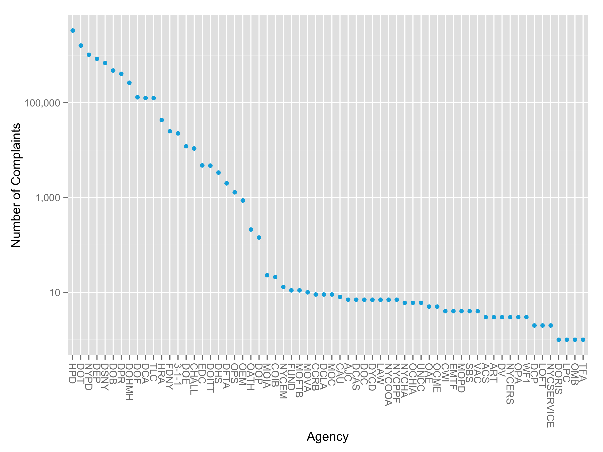
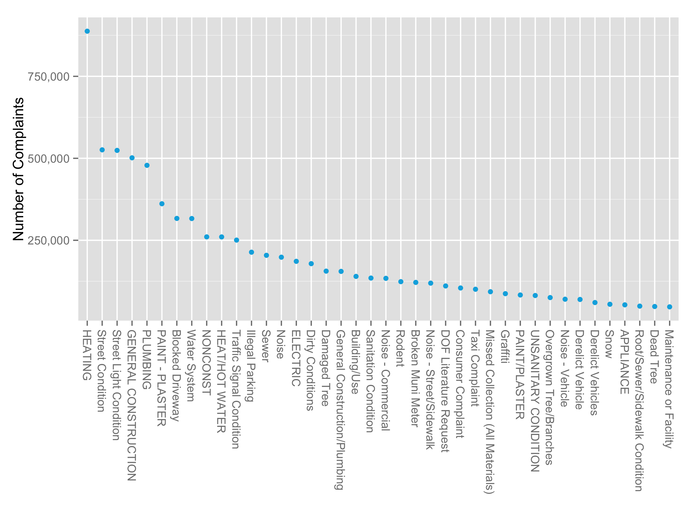
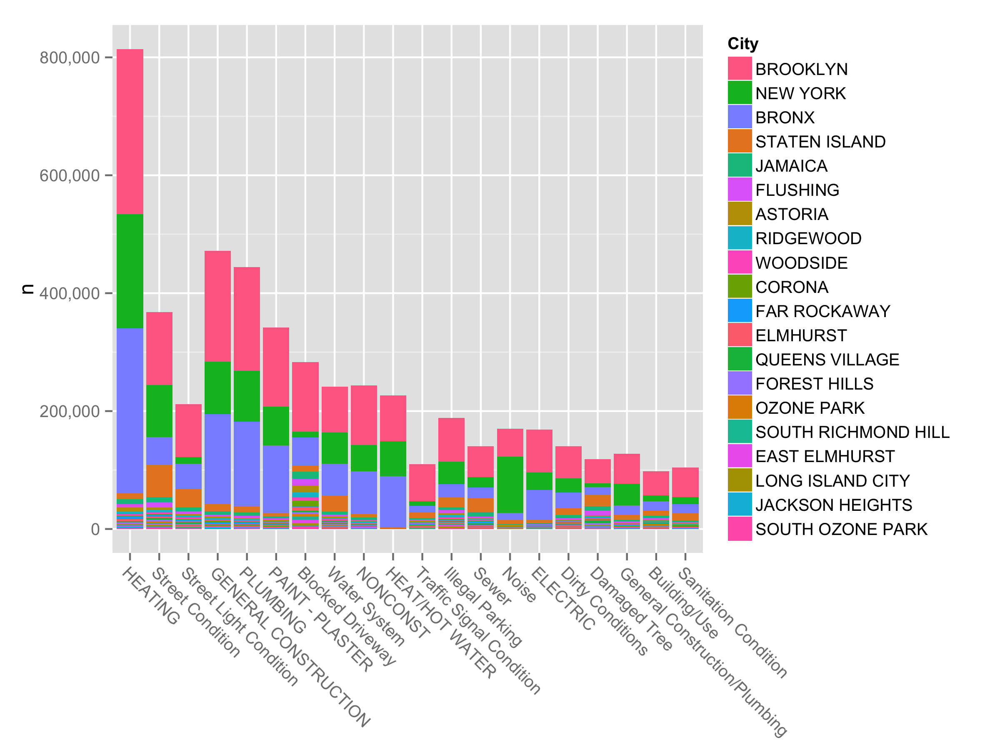
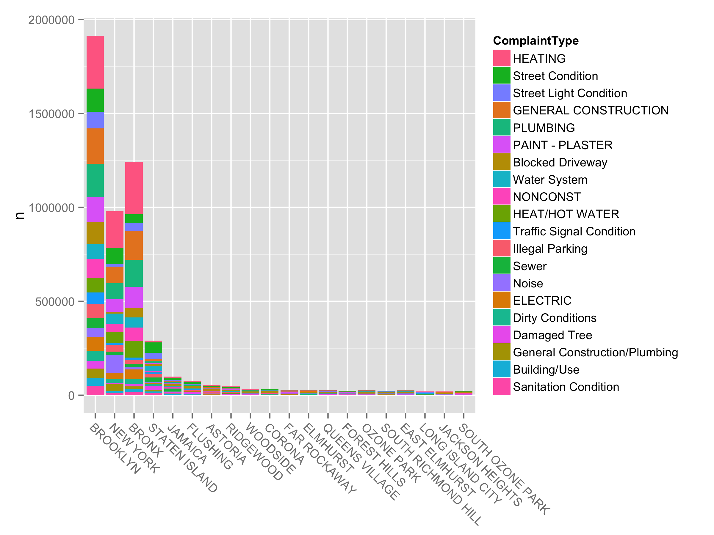
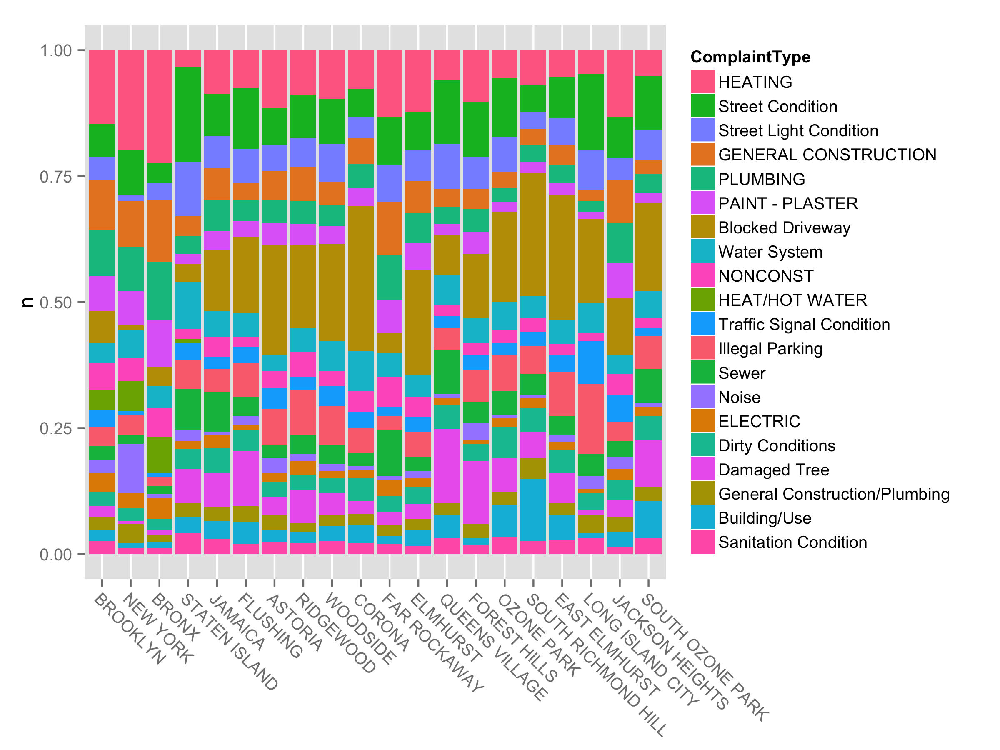
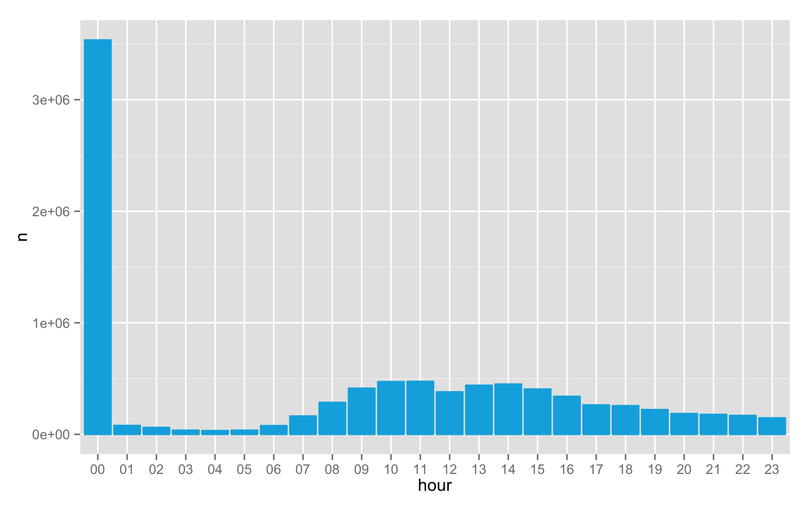
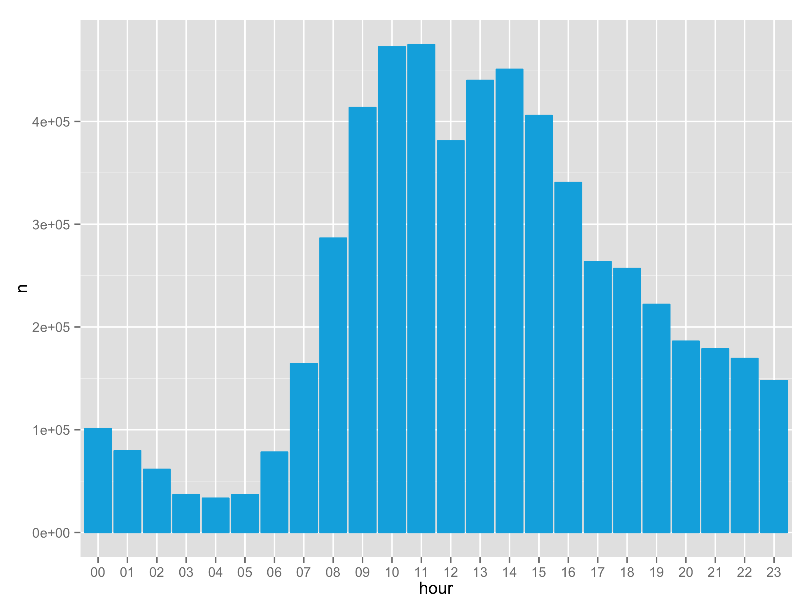
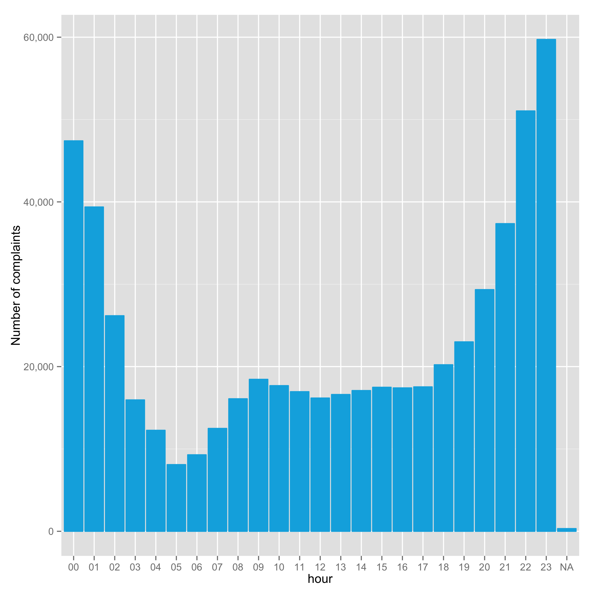
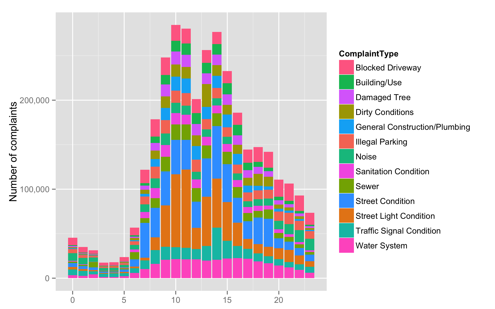
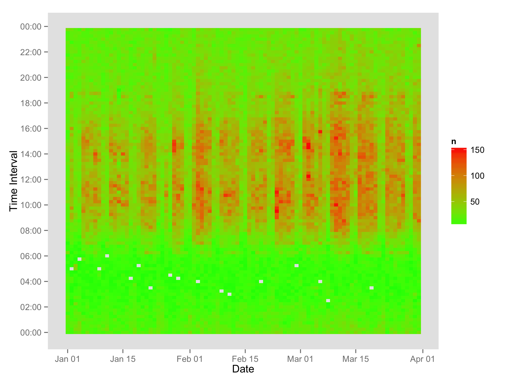

<style type="text/css">
div.code_chunk {
border-left: rgb(123, 218, 123);
border-left-width: thick;
border-left-style: solid;
}

pre.time {
display: block;b
padding-right: 1ex;
Background-color: rgb(123, 218, 123);
padding: 0.2em;
margin-left: 0em;
margin-bottom: 0em;
border: none;
border-radius: initial;
color: rgba(255, 255, 255, 0.75);
font-size: 0.6em;
}
</style>
**The rmd source file is available on
[github](https://github.com/luckyrandom/blog/tree/source/contents/articles/00050-311-service/311service.Rmd).**

#Summary

This is a long post. I put my thought about this project in the
beginning, so you can skip all the details.

- In memory implementation is in general faster than database. If your
data is not that big, try in memory implementation.
- The dplyr wrap makes it easy to switch from one implementation to
another, though it is not effortless.
- Be careful with unusual values. "00:00:00" may mean NA.
- Choose an informative plot.

#Introduction

The article
[Big data analytics with Pandas and SQLite](https://plot.ly/ipython-notebooks/big-data-analytics-with-pandas-and-sqlite/#A-Large-Data-Workflow-with-Pandas)
on [plot.ly](https://plot.ly/) demonstrates a large data workflow with
Pandas, Python and SQLite. As suggested by
[Hadley Wickham](https://twitter.com/hadleywickham) on
[twitter](https://twitter.com/hadleywickham/status/586946466570047488),
this post reimplements it in R for comparison. It may not be a fair
comparison, since reimplement is easier than original
analysis. This post owes a debt of gratitude to the
[original post](https://plot.ly/ipython-notebooks/big-data-analytics-with-pandas-and-sqlite/#A-Large-Data-Workflow-with-Pandas)
for its great analysis.

The data file is composed of about 9.1 million rows of data (a
diiferent size from the post on plot.ly, since the size increases
everyday), containing NYC's 311 complaints since 2003. The data file
is too large to track in git, and can be download from
[NYC's open data portal](https://nycopendata.socrata.com/Social-Services/311-Service-Requests-from-2010-to-Present/erm2-nwe9).

The original article performs out-of-memory aggregations with SQLite,
since the dataset is too large to load into a Pandas
dataframe. However, the few columns we are interested in can be loaded
in memory easily. This post compares three different implementation in
R

- dplyr wrap of in memory data.frame
- dplyr wrap of SQLite database
- SQL command with SQLite database

Functions from `dplyr` and pipe function `%>%` are heavily used in
this post. Listed below are a few references about them.

- [Vignette about `%>%` and `%T>%`](http://cran.r-project.org/web/packages/magrittr/vignettes/magrittr.html)
- [Introduction to dplyr](http://cran.rstudio.com/web/packages/dplyr/vignettes/introduction.html)
- [Introduction to dplyr SQL backend](http://cran.rstudio.com/web/packages/dplyr/vignettes/new-sql-backend.html)

The code of the first half of post is direct translation of the Python
code from the original post, and the SQL code is mostly copied from
original post. The second half, starting from section about plot, is
more or less different from the original post for two
reasons.

Firstly, the original post use interactive plot heavily by
[plot.ly](https://plot.ly/), but it's not easy to draw active plot in
R (which indeed means I'm not good at it in R).

Secondly and more importantly, I hold a different opinion about some
of the plots. Although the interactive plots are cool, the information
included is too dense to be useful. You can hover mouse on the plot to
get detail information, but you don't know where to hover when the
plot include more than hundreds of columns or rows of data. Instead,
the plots in this posts focus on top values. Also, some of the bar
charts are replaced by dots plots and heat plots when they are more
informative.

This post is written in `rmarkdown` and rendered by
[knitr](http://yihui.name/knitr/) and [pandoc](http://pandoc.org/), or
can be rendered by [R Markdown v2](http://rmarkdown.rstudio.com/), if
you prefer. The CPU time is measured with some special hook of knitr,
and reported both as number and color of header of each chunk, with
red representing long run time. Please check the source code if you
are interested in the implementation.


## Load dataset
<div class="code_chunk">


```r
## load R packages
library(readr)
library(plyr)
library(dplyr)
```

```
## 
## Attaching package: 'dplyr'
## 
## The following objects are masked from 'package:plyr':
## 
##     arrange, count, desc, failwith, id, mutate, rename, summarise,
##     summarize
## 
## The following object is masked from 'package:stats':
## 
##     filter
## 
## The following objects are masked from 'package:base':
## 
##     intersect, setdiff, setequal, union
```

```r
library(scales)
library(ggplot2)
library(DBI)
library(grid)
theme_update(plot.background = element_blank(),
             legend.background = element_blank())
```
</div>

Load a few lines to check the structure.

<div class="code_chunk">


```r
## Data file is stored in sub-directory `noshare`
file_311 <- file.path("noshare",
                      "311_Service_Requests_from_2010_to_Present.csv")
(head_service <- read_csv(file_311, n_max = 100))
```

```
## Source: local data frame [100 x 52]
## 
##    Unique Key           Created Date            Closed Date Agency
## 1    30379793 04/12/2015 02:41:17 AM                           DOT
## 2    30378748 04/12/2015 02:08:53 AM 04/12/2015 02:09:52 AM    HRA
## 3    30380600 04/12/2015 02:08:40 AM                          NYPD
## 4    30378453 04/12/2015 02:08:24 AM                          NYPD
## 5    30381446 04/12/2015 02:04:39 AM                          NYPD
## 6    30378546 04/12/2015 02:01:31 AM 04/12/2015 02:47:01 AM   NYPD
## 7    30379756 04/12/2015 02:00:35 AM 04/12/2015 02:55:34 AM   NYPD
## 8    30377618 04/12/2015 01:59:14 AM                          NYPD
## 9    30378524 04/12/2015 01:58:18 AM 04/12/2015 01:58:41 AM    DHS
## 10   30382370 04/12/2015 01:57:05 AM                          NYPD
## ..        ...                    ...                    ...    ...
## Variables not shown: Agency Name (chr), Complaint Type (chr), Descriptor
##   (chr), Location Type (chr), Incident Zip (int), Incident Address (chr),
##   Street Name (chr), Cross Street 1 (chr), Cross Street 2 (chr),
##   Intersection Street 1 (chr), Intersection Street 2 (chr), Address Type
##   (chr), City (chr), Landmark (lgl), Facility Type (chr), Status (chr),
##   Due Date (chr), Resolution Action Updated Date (chr), Community Board
##   (chr), Borough (chr), X Coordinate (State Plane) (int), Y Coordinate
##   (State Plane) (int), Park Facility Name (chr), Park Borough (chr),
##   School Name (chr), School Number (chr), School Region (chr), School Code
##   (chr), School Phone Number (chr), School Address (chr), School City
##   (chr), School State (chr), School Zip (chr), School Not Found (chr),
##   School or Citywide Complaint (lgl), Vehicle Type (lgl), Taxi Company
##   Borough (lgl), Taxi Pick Up Location (chr), Bridge Highway Name (lgl),
##   Bridge Highway Direction (lgl), Road Ramp (lgl), Bridge Highway Segment
##   (lgl), Garage Lot Name (lgl), Ferry Direction (lgl), Ferry Terminal Name
##   (lgl), Latitude (dbl), Longitude (dbl), Location (chr)
```
</div>

Load the columns we are interested in. Thanks to `readr`, the loading is pretty fast.

<div class="code_chunk">
<pre class = time style="background-image: -webkit-linear-gradient(left, rgb(123, 218, 123), rgb(124, 217, 122)); /* For Chrome 25 and Safari 6, iOS 6.1, Android 4.3 */
  background-image:    -moz-linear-gradient(left, rgb(123, 218, 123), rgb(124, 217, 122)); /* For Firefox (3.6 to 15) */
  background-image:      -o-linear-gradient(left, rgb(123, 218, 123), rgb(124, 217, 122)); /* For old Opera (11.1 to 12.0) */ 
  background-image:         linear-gradient(to right, rgb(123, 218, 123), rgb(124, 217, 122)); /* Standard syntax; must be last */">user: 0.012 | system: 0.001 | elapsed: 0.012</pre>

```r
load_columns <- c('Agency', 'Created Date', 'Closed Date',
                  'Complaint Type', 'Descriptor', 'City')
col_types <- rep(list(col_skip()), length(colnames(head_service)))
names(col_types) <- colnames(head_service)
col_types[load_columns] <- rep(list(col_character()), 6) 
```
</div>

<div class="code_chunk">
<pre class = time style="background-image: -webkit-linear-gradient(left, rgb(123, 218, 123), rgb(255, 0, 0)); /* For Chrome 25 and Safari 6, iOS 6.1, Android 4.3 */
  background-image:    -moz-linear-gradient(left, rgb(123, 218, 123), rgb(255, 0, 0)); /* For Firefox (3.6 to 15) */
  background-image:      -o-linear-gradient(left, rgb(123, 218, 123), rgb(255, 0, 0)); /* For old Opera (11.1 to 12.0) */ 
  background-image:         linear-gradient(to right, rgb(123, 218, 123), rgb(255, 0, 0)); /* Standard syntax; must be last */">user:  82.88 | system:   8.53 | elapsed: 118.16</pre>

```r
system.time(service_char <-
    read_delim(file_311, delim = ",", col_types = col_types, progress = FALSE))
```

```
## 
|================================================================================| 100% 4420 MB
```

```
##    user  system elapsed 
##  82.834   8.526 118.111
```
</div>

Change data types as needed.

<div class="code_chunk">
<pre class = time style="background-image: -webkit-linear-gradient(left, rgb(123, 218, 123), rgb(255, 0, 0)); /* For Chrome 25 and Safari 6, iOS 6.1, Android 4.3 */
  background-image:    -moz-linear-gradient(left, rgb(123, 218, 123), rgb(255, 0, 0)); /* For Firefox (3.6 to 15) */
  background-image:      -o-linear-gradient(left, rgb(123, 218, 123), rgb(255, 0, 0)); /* For old Opera (11.1 to 12.0) */ 
  background-image:         linear-gradient(to right, rgb(123, 218, 123), rgb(255, 0, 0)); /* Standard syntax; must be last */">user: 233.79 | system:   9.06 | elapsed: 246.21</pre>

```r
## rm white space in column names 
colnames(service_char) <- sub(" ", "", colnames(service_char))
time_format <- "%m/%d/%Y %I:%M:%S %p"
service <- within(service_char, {
                      Agency <- as.factor(Agency)
                      CreatedDate  <-  strftime(as.POSIXlt(CreatedDate, format = time_format))
                      ClosedDate <-  strftime(as.POSIXlt(ClosedDate, format = time_format))
                      ComplaintType  <- as.factor(ComplaintType)
                      City <- as.factor(City)
                  })
print(object.size(service), units = "Mb")
```

```
## 829.6 Mb
```

```r
rm(service_char)
gc()
```

```
##             used  (Mb) gc trigger   (Mb)  max used   (Mb)
## Ncells   7363033 393.3   41814278 2233.2  41615065 2222.5
## Vcells 102734572 783.9  517222059 3946.1 645682158 4926.2
```
</div>
The size of object is about 1 Gb, which can be easily loaded in memory.

Check the loaded data.

<div class="code_chunk">
<pre class = time style="background-image: -webkit-linear-gradient(left, rgb(123, 218, 123), rgb(124, 216, 122)); /* For Chrome 25 and Safari 6, iOS 6.1, Android 4.3 */
  background-image:    -moz-linear-gradient(left, rgb(123, 218, 123), rgb(124, 216, 122)); /* For Firefox (3.6 to 15) */
  background-image:      -o-linear-gradient(left, rgb(123, 218, 123), rgb(124, 216, 122)); /* For old Opera (11.1 to 12.0) */ 
  background-image:         linear-gradient(to right, rgb(123, 218, 123), rgb(124, 216, 122)); /* Standard syntax; must be last */">user: 0.012 | system: 0.002 | elapsed: 0.018</pre>

```r
service
```

```
## Source: local data frame [9,115,505 x 6]
## 
##            CreatedDate          ClosedDate Agency
## 1  2015-04-12 02:41:17                  NA    DOT
## 2  2015-04-12 02:08:53 2015-04-12 02:09:52    HRA
## 3  2015-04-12 02:08:40                  NA   NYPD
## 4  2015-04-12 02:08:24                  NA   NYPD
## 5  2015-04-12 02:04:39                  NA   NYPD
## 6  2015-04-12 02:01:31 2015-04-12 02:47:01   NYPD
## 7  2015-04-12 02:00:35 2015-04-12 02:55:34   NYPD
## 8  2015-04-12 01:59:14                  NA   NYPD
## 9  2015-04-12 01:58:18 2015-04-12 01:58:41    DHS
## 10 2015-04-12 01:57:05                  NA   NYPD
## ..                 ...                 ...    ...
## Variables not shown: ComplaintType (fctr), Descriptor (chr), City (fctr)
```
</div>

Note that the dataset is printed neatly, without calling `head`
function explicitly. The S3 class of `service` is `tbl_df`. According
to the document, "The main advantage to using a 'tbl_df' over a
regular data frame is the printing: tbl objects only print a few rows
and all the columns that fit on one screen, describing the rest of it
as text."

Then we save the service table to SQLite database. If the data is
larger, we may have to load and save by chunk, but I will cheat here
by loading and saving the whole data, until
[readr](https://github.com/hadley/readr) provides better support for
[this feature](https://github.com/hadley/readr/issues/118).

<div class="code_chunk">
<pre class = time style="background-image: -webkit-linear-gradient(left, rgb(123, 218, 123), rgb(128, 210, 118)); /* For Chrome 25 and Safari 6, iOS 6.1, Android 4.3 */
  background-image:    -moz-linear-gradient(left, rgb(123, 218, 123), rgb(128, 210, 118)); /* For Firefox (3.6 to 15) */
  background-image:      -o-linear-gradient(left, rgb(123, 218, 123), rgb(128, 210, 118)); /* For old Opera (11.1 to 12.0) */ 
  background-image:         linear-gradient(to right, rgb(123, 218, 123), rgb(128, 210, 118)); /* Standard syntax; must be last */">user: 0.050 | system: 0.006 | elapsed: 0.075</pre>

```r
sql_file <- file.path("noshare", "service.sqlite")
if( !file.exists( sql_file ) ||
   file.mtime(file_311) > file.mtime( sql_file ) ) {
    db <- dbConnect(RSQLite::SQLite(), sql_file)
    ## Temperary fix for issue https://github.com/rstats-db/RSQLite/issues/82
    setOldClass(c("tbl_df", "data.frame"))
    dbWriteTable(db, "data", service, row.names = FALSE, overwrite = FALSE)
} else {
    db <- dbConnect(RSQLite::SQLite(), sql_file)
}
```
</div>

Create dplyr wrap of SQLite database.

<div class="code_chunk">
<pre class = time style="background-image: -webkit-linear-gradient(left, rgb(123, 218, 123), rgb(125, 215, 121)); /* For Chrome 25 and Safari 6, iOS 6.1, Android 4.3 */
  background-image:    -moz-linear-gradient(left, rgb(123, 218, 123), rgb(125, 215, 121)); /* For Firefox (3.6 to 15) */
  background-image:      -o-linear-gradient(left, rgb(123, 218, 123), rgb(125, 215, 121)); /* For old Opera (11.1 to 12.0) */ 
  background-image:         linear-gradient(to right, rgb(123, 218, 123), rgb(125, 215, 121)); /* Standard syntax; must be last */">user: 0.019 | system: 0.002 | elapsed: 0.028</pre>

```r
service_db <- tbl(src_sqlite(sql_file, create = FALSE), "data")
```
</div>

`service` is a dplyr wrap of in memory data.frame, and `service_db` is
a dplyr wrap of the SQLite database. They share similar interfaces,
and most functions that applied to one object can be applied to the
other object without any change. `dplyr` translates the function calls
applied to `service_db` to SQL command, which can be checked with
function `explain`. The following function is defined to check the SQL
command and then retrieve the value.

<div class="code_chunk">


```r
explain_and_eval <- function(x, ...) {
    print(explain(x, ...))
    x
}
```
</div>

# Preview the table

<div class="code_chunk">
<pre class = time style="background-image: -webkit-linear-gradient(left, rgb(123, 218, 123), rgb(123, 217, 123)); /* For Chrome 25 and Safari 6, iOS 6.1, Android 4.3 */
  background-image:    -moz-linear-gradient(left, rgb(123, 218, 123), rgb(123, 217, 123)); /* For Firefox (3.6 to 15) */
  background-image:      -o-linear-gradient(left, rgb(123, 218, 123), rgb(123, 217, 123)); /* For old Opera (11.1 to 12.0) */ 
  background-image:         linear-gradient(to right, rgb(123, 218, 123), rgb(123, 217, 123)); /* Standard syntax; must be last */">user: 0.006 | system: 0.000 | elapsed: 0.006</pre>

```r
dbGetQuery(db, 'SELECT * FROM data LIMIT 3')
```

```
##           CreatedDate          ClosedDate Agency            ComplaintType
## 1 2015-04-12 02:41:17                <NA>    DOT         Street Condition
## 2 2015-04-12 02:08:53 2015-04-12 02:09:52    HRA Benefit Card Replacement
## 3 2015-04-12 02:08:40                <NA>   NYPD       Noise - Commercial
##         Descriptor     City
## 1          Pothole         
## 2         Medicaid         
## 3 Loud Music/Party NEW YORK
```
</div>

<div class="code_chunk">
<pre class = time style="background-image: -webkit-linear-gradient(left, rgb(123, 218, 123), rgb(123, 217, 123)); /* For Chrome 25 and Safari 6, iOS 6.1, Android 4.3 */
  background-image:    -moz-linear-gradient(left, rgb(123, 218, 123), rgb(123, 217, 123)); /* For Firefox (3.6 to 15) */
  background-image:      -o-linear-gradient(left, rgb(123, 218, 123), rgb(123, 217, 123)); /* For old Opera (11.1 to 12.0) */ 
  background-image:         linear-gradient(to right, rgb(123, 218, 123), rgb(123, 217, 123)); /* Standard syntax; must be last */">user: 0.005 | system: 0.000 | elapsed: 0.006</pre>

```r
print.data.frame(head(service, 3))
```

```
##           CreatedDate          ClosedDate Agency            ComplaintType
## 1 2015-04-12 02:41:17                <NA>    DOT         Street Condition
## 2 2015-04-12 02:08:53 2015-04-12 02:09:52    HRA Benefit Card Replacement
## 3 2015-04-12 02:08:40                <NA>   NYPD       Noise - Commercial
##         Descriptor     City
## 1          Pothole         
## 2         Medicaid         
## 3 Loud Music/Party NEW YORK
```
</div>

<div class="code_chunk">
<pre class = time style="background-image: -webkit-linear-gradient(left, rgb(123, 218, 123), rgb(131, 205, 116)); /* For Chrome 25 and Safari 6, iOS 6.1, Android 4.3 */
  background-image:    -moz-linear-gradient(left, rgb(123, 218, 123), rgb(131, 205, 116)); /* For Firefox (3.6 to 15) */
  background-image:      -o-linear-gradient(left, rgb(123, 218, 123), rgb(131, 205, 116)); /* For old Opera (11.1 to 12.0) */ 
  background-image:         linear-gradient(to right, rgb(123, 218, 123), rgb(131, 205, 116)); /* Standard syntax; must be last */">user: 0.045 | system: 0.057 | elapsed: 0.115</pre>

```r
## A different way to check the structure of object
str(service)
```

```
## Classes 'tbl_df', 'tbl' and 'data.frame':	9115505 obs. of  6 variables:
##  $ CreatedDate  : chr  "2015-04-12 02:41:17" "2015-04-12 02:08:53" "2015-04-12 02:08:40" "2015-04-12 02:08:24" ...
##  $ ClosedDate   : chr  NA "2015-04-12 02:09:52" NA NA ...
##  $ Agency       : Factor w/ 64 levels "3-1-1","ACS",..: 25 35 50 50 50 50 50 50 16 50 ...
##  $ ComplaintType: Factor w/ 245 levels "Adopt-A-Basket",..: 203 10 135 139 135 139 135 139 103 135 ...
##  $ Descriptor   : chr  "Pothole" "Medicaid" "Loud Music/Party" "Loud Talking" ...
##  $ City         : Factor w/ 1817 levels "","*","/","/A",..: 1 1 1080 877 1080 1080 65 181 1 1080 ...
```
</div>

<div class="code_chunk">
<pre class = time style="background-image: -webkit-linear-gradient(left, rgb(123, 218, 123), rgb(124, 217, 122)); /* For Chrome 25 and Safari 6, iOS 6.1, Android 4.3 */
  background-image:    -moz-linear-gradient(left, rgb(123, 218, 123), rgb(124, 217, 122)); /* For Firefox (3.6 to 15) */
  background-image:      -o-linear-gradient(left, rgb(123, 218, 123), rgb(124, 217, 122)); /* For old Opera (11.1 to 12.0) */ 
  background-image:         linear-gradient(to right, rgb(123, 218, 123), rgb(124, 217, 122)); /* Standard syntax; must be last */">user: 0.01 | system: 0.00 | elapsed: 0.01</pre>

```r
head(service, 3)
```

```
## Source: local data frame [3 x 6]
## 
##           CreatedDate          ClosedDate Agency            ComplaintType
## 1 2015-04-12 02:41:17                  NA    DOT         Street Condition
## 2 2015-04-12 02:08:53 2015-04-12 02:09:52    HRA Benefit Card Replacement
## 3 2015-04-12 02:08:40                  NA   NYPD       Noise - Commercial
## Variables not shown: Descriptor (chr), City (fctr)
```
</div>

<div class="code_chunk">
<pre class = time style="background-image: -webkit-linear-gradient(left, rgb(123, 218, 123), rgb(124, 217, 122)); /* For Chrome 25 and Safari 6, iOS 6.1, Android 4.3 */
  background-image:    -moz-linear-gradient(left, rgb(123, 218, 123), rgb(124, 217, 122)); /* For Firefox (3.6 to 15) */
  background-image:      -o-linear-gradient(left, rgb(123, 218, 123), rgb(124, 217, 122)); /* For old Opera (11.1 to 12.0) */ 
  background-image:         linear-gradient(to right, rgb(123, 218, 123), rgb(124, 217, 122)); /* Standard syntax; must be last */">user: 0.01 | system: 0.00 | elapsed: 0.01</pre>

```r
head(service_db, 3)
```

```
##           CreatedDate          ClosedDate Agency            ComplaintType
## 1 2015-04-12 02:41:17                <NA>    DOT         Street Condition
## 2 2015-04-12 02:08:53 2015-04-12 02:09:52    HRA Benefit Card Replacement
## 3 2015-04-12 02:08:40                <NA>   NYPD       Noise - Commercial
##         Descriptor     City
## 1          Pothole         
## 2         Medicaid         
## 3 Loud Music/Party NEW YORK
```
</div>

We don't have to call `head`, as I mentioned above.
<div class="code_chunk">
<pre class = time style="background-image: -webkit-linear-gradient(left, rgb(123, 218, 123), rgb(124, 217, 122)); /* For Chrome 25 and Safari 6, iOS 6.1, Android 4.3 */
  background-image:    -moz-linear-gradient(left, rgb(123, 218, 123), rgb(124, 217, 122)); /* For Firefox (3.6 to 15) */
  background-image:      -o-linear-gradient(left, rgb(123, 218, 123), rgb(124, 217, 122)); /* For old Opera (11.1 to 12.0) */ 
  background-image:         linear-gradient(to right, rgb(123, 218, 123), rgb(124, 217, 122)); /* Standard syntax; must be last */">user: 0.009 | system: 0.000 | elapsed: 0.009</pre>

```r
service
```

```
## Source: local data frame [9,115,505 x 6]
## 
##            CreatedDate          ClosedDate Agency
## 1  2015-04-12 02:41:17                  NA    DOT
## 2  2015-04-12 02:08:53 2015-04-12 02:09:52    HRA
## 3  2015-04-12 02:08:40                  NA   NYPD
## 4  2015-04-12 02:08:24                  NA   NYPD
## 5  2015-04-12 02:04:39                  NA   NYPD
## 6  2015-04-12 02:01:31 2015-04-12 02:47:01   NYPD
## 7  2015-04-12 02:00:35 2015-04-12 02:55:34   NYPD
## 8  2015-04-12 01:59:14                  NA   NYPD
## 9  2015-04-12 01:58:18 2015-04-12 01:58:41    DHS
## 10 2015-04-12 01:57:05                  NA   NYPD
## ..                 ...                 ...    ...
## Variables not shown: ComplaintType (fctr), Descriptor (chr), City (fctr)
```
</div>

<div class="code_chunk">
<pre class = time style="background-image: -webkit-linear-gradient(left, rgb(123, 218, 123), rgb(255, 0, 0)); /* For Chrome 25 and Safari 6, iOS 6.1, Android 4.3 */
  background-image:    -moz-linear-gradient(left, rgb(123, 218, 123), rgb(255, 0, 0)); /* For Firefox (3.6 to 15) */
  background-image:      -o-linear-gradient(left, rgb(123, 218, 123), rgb(255, 0, 0)); /* For old Opera (11.1 to 12.0) */ 
  background-image:         linear-gradient(to right, rgb(123, 218, 123), rgb(255, 0, 0)); /* Standard syntax; must be last */">user:  0.605 | system:  2.153 | elapsed: 10.347</pre>

```r
service_db
```

```
## Source: sqlite 3.8.6 [noshare/service.sqlite]
## From: data [9,115,505 x 6]
## 
##            CreatedDate          ClosedDate Agency
## 1  2015-04-12 02:41:17                  NA    DOT
## 2  2015-04-12 02:08:53 2015-04-12 02:09:52    HRA
## 3  2015-04-12 02:08:40                  NA   NYPD
## 4  2015-04-12 02:08:24                  NA   NYPD
## 5  2015-04-12 02:04:39                  NA   NYPD
## 6  2015-04-12 02:01:31 2015-04-12 02:47:01   NYPD
## 7  2015-04-12 02:00:35 2015-04-12 02:55:34   NYPD
## 8  2015-04-12 01:59:14                  NA   NYPD
## 9  2015-04-12 01:58:18 2015-04-12 01:58:41    DHS
## 10 2015-04-12 01:57:05                  NA   NYPD
## ..                 ...                 ...    ...
## Variables not shown: ComplaintType (chr), Descriptor (chr), City (chr)
```
</div>

# Select just a couple of columns
<div class="code_chunk">
<pre class = time style="background-image: -webkit-linear-gradient(left, rgb(123, 218, 123), rgb(123, 217, 123)); /* For Chrome 25 and Safari 6, iOS 6.1, Android 4.3 */
  background-image:    -moz-linear-gradient(left, rgb(123, 218, 123), rgb(123, 217, 123)); /* For Firefox (3.6 to 15) */
  background-image:      -o-linear-gradient(left, rgb(123, 218, 123), rgb(123, 217, 123)); /* For old Opera (11.1 to 12.0) */ 
  background-image:         linear-gradient(to right, rgb(123, 218, 123), rgb(123, 217, 123)); /* Standard syntax; must be last */">user: 0.006 | system: 0.000 | elapsed: 0.006</pre>

```r
service[1:3, c("Agency", "Descriptor")]
```

```
## Source: local data frame [3 x 2]
## 
##   Agency       Descriptor
## 1    DOT          Pothole
## 2    HRA         Medicaid
## 3   NYPD Loud Music/Party
```
</div>

<div class="code_chunk">
<pre class = time style="background-image: -webkit-linear-gradient(left, rgb(123, 218, 123), rgb(124, 216, 122)); /* For Chrome 25 and Safari 6, iOS 6.1, Android 4.3 */
  background-image:    -moz-linear-gradient(left, rgb(123, 218, 123), rgb(124, 216, 122)); /* For Firefox (3.6 to 15) */
  background-image:      -o-linear-gradient(left, rgb(123, 218, 123), rgb(124, 216, 122)); /* For old Opera (11.1 to 12.0) */ 
  background-image:         linear-gradient(to right, rgb(123, 218, 123), rgb(124, 216, 122)); /* Standard syntax; must be last */">user: 0.014 | system: 0.002 | elapsed: 0.019</pre>

```r
service %>%
  select(Agency, Descriptor) %>%
  head(3)
```

```
## Source: local data frame [3 x 2]
## 
##   Agency       Descriptor
## 1    DOT          Pothole
## 2    HRA         Medicaid
## 3   NYPD Loud Music/Party
```
</div>

<div class="code_chunk">
<pre class = time style="background-image: -webkit-linear-gradient(left, rgb(123, 218, 123), rgb(124, 217, 122)); /* For Chrome 25 and Safari 6, iOS 6.1, Android 4.3 */
  background-image:    -moz-linear-gradient(left, rgb(123, 218, 123), rgb(124, 217, 122)); /* For Firefox (3.6 to 15) */
  background-image:      -o-linear-gradient(left, rgb(123, 218, 123), rgb(124, 217, 122)); /* For old Opera (11.1 to 12.0) */ 
  background-image:         linear-gradient(to right, rgb(123, 218, 123), rgb(124, 217, 122)); /* Standard syntax; must be last */">user: 0.012 | system: 0.001 | elapsed: 0.012</pre>

```r
service_db %>%
  select(Agency, Descriptor) %>%
  head(3)
```

```
##   Agency       Descriptor
## 1    DOT          Pothole
## 2    HRA         Medicaid
## 3   NYPD Loud Music/Party
```
</div>

<div class="code_chunk">
<pre class = time style="background-image: -webkit-linear-gradient(left, rgb(123, 218, 123), rgb(123, 217, 123)); /* For Chrome 25 and Safari 6, iOS 6.1, Android 4.3 */
  background-image:    -moz-linear-gradient(left, rgb(123, 218, 123), rgb(123, 217, 123)); /* For Firefox (3.6 to 15) */
  background-image:      -o-linear-gradient(left, rgb(123, 218, 123), rgb(123, 217, 123)); /* For old Opera (11.1 to 12.0) */ 
  background-image:         linear-gradient(to right, rgb(123, 218, 123), rgb(123, 217, 123)); /* Standard syntax; must be last */">user: 0.005 | system: 0.000 | elapsed: 0.005</pre>

```r
dbGetQuery(db, 'SELECT Agency, Descriptor FROM data LIMIT 3')
```

```
##   Agency       Descriptor
## 1    DOT          Pothole
## 2    HRA         Medicaid
## 3   NYPD Loud Music/Party
```
</div>

# Filter rows by value
<div class="code_chunk">
<pre class = time style="background-image: -webkit-linear-gradient(left, rgb(123, 218, 123), rgb(177, 128, 72)); /* For Chrome 25 and Safari 6, iOS 6.1, Android 4.3 */
  background-image:    -moz-linear-gradient(left, rgb(123, 218, 123), rgb(177, 128, 72)); /* For Firefox (3.6 to 15) */
  background-image:      -o-linear-gradient(left, rgb(123, 218, 123), rgb(177, 128, 72)); /* For old Opera (11.1 to 12.0) */ 
  background-image:         linear-gradient(to right, rgb(123, 218, 123), rgb(177, 128, 72)); /* Standard syntax; must be last */">user: 0.730 | system: 0.092 | elapsed: 0.824</pre>

```r
service %>%
  select(ComplaintType, Descriptor, Agency) %>%
  filter(Agency == "NYPD")
```

```
## Source: local data frame [1,021,412 x 3]
## 
##              ComplaintType       Descriptor Agency
## 1       Noise - Commercial Loud Music/Party   NYPD
## 2  Noise - Street/Sidewalk     Loud Talking   NYPD
## 3       Noise - Commercial Loud Music/Party   NYPD
## 4  Noise - Street/Sidewalk     Loud Talking   NYPD
## 5       Noise - Commercial Loud Music/Party   NYPD
## 6  Noise - Street/Sidewalk Loud Music/Party   NYPD
## 7       Noise - Commercial  Car/Truck Music   NYPD
## 8       Noise - Commercial Loud Music/Party   NYPD
## 9         Blocked Driveway   Partial Access   NYPD
## 10      Noise - Commercial Loud Music/Party   NYPD
## ..                     ...              ...    ...
```
</div>

<div class="code_chunk">
<pre class = time style="background-image: -webkit-linear-gradient(left, rgb(123, 218, 123), rgb(255, 0, 0)); /* For Chrome 25 and Safari 6, iOS 6.1, Android 4.3 */
  background-image:    -moz-linear-gradient(left, rgb(123, 218, 123), rgb(255, 0, 0)); /* For Firefox (3.6 to 15) */
  background-image:      -o-linear-gradient(left, rgb(123, 218, 123), rgb(255, 0, 0)); /* For old Opera (11.1 to 12.0) */ 
  background-image:         linear-gradient(to right, rgb(123, 218, 123), rgb(255, 0, 0)); /* Standard syntax; must be last */">user: 1.669 | system: 0.874 | elapsed: 2.550</pre>

```r
service_db %>%
  select(ComplaintType, Descriptor, Agency) %>%
  filter(Agency == "NYPD")
```

```
## Source: sqlite 3.8.6 [noshare/service.sqlite]
## From: data [1,021,412 x 3]
## Filter: Agency == "NYPD" 
## 
##              ComplaintType       Descriptor Agency
## 1       Noise - Commercial Loud Music/Party   NYPD
## 2  Noise - Street/Sidewalk     Loud Talking   NYPD
## 3       Noise - Commercial Loud Music/Party   NYPD
## 4  Noise - Street/Sidewalk     Loud Talking   NYPD
## 5       Noise - Commercial Loud Music/Party   NYPD
## 6  Noise - Street/Sidewalk Loud Music/Party   NYPD
## 7       Noise - Commercial  Car/Truck Music   NYPD
## 8       Noise - Commercial Loud Music/Party   NYPD
## 9         Blocked Driveway   Partial Access   NYPD
## 10      Noise - Commercial Loud Music/Party   NYPD
## ..                     ...              ...    ...
```
</div>

We don't have to call `head`, but it runs faster here if we call `head`.

<div class="code_chunk">
<pre class = time style="background-image: -webkit-linear-gradient(left, rgb(123, 218, 123), rgb(255, 0, 0)); /* For Chrome 25 and Safari 6, iOS 6.1, Android 4.3 */
  background-image:    -moz-linear-gradient(left, rgb(123, 218, 123), rgb(255, 0, 0)); /* For Firefox (3.6 to 15) */
  background-image:      -o-linear-gradient(left, rgb(123, 218, 123), rgb(255, 0, 0)); /* For old Opera (11.1 to 12.0) */ 
  background-image:         linear-gradient(to right, rgb(123, 218, 123), rgb(255, 0, 0)); /* Standard syntax; must be last */">user: 1.672 | system: 0.874 | elapsed: 2.552</pre>

```r
service_db %>%
  select(ComplaintType, Descriptor, Agency) %>%
  filter(Agency == "NYPD")
```

```
## Source: sqlite 3.8.6 [noshare/service.sqlite]
## From: data [1,021,412 x 3]
## Filter: Agency == "NYPD" 
## 
##              ComplaintType       Descriptor Agency
## 1       Noise - Commercial Loud Music/Party   NYPD
## 2  Noise - Street/Sidewalk     Loud Talking   NYPD
## 3       Noise - Commercial Loud Music/Party   NYPD
## 4  Noise - Street/Sidewalk     Loud Talking   NYPD
## 5       Noise - Commercial Loud Music/Party   NYPD
## 6  Noise - Street/Sidewalk Loud Music/Party   NYPD
## 7       Noise - Commercial  Car/Truck Music   NYPD
## 8       Noise - Commercial Loud Music/Party   NYPD
## 9         Blocked Driveway   Partial Access   NYPD
## 10      Noise - Commercial Loud Music/Party   NYPD
## ..                     ...              ...    ...
```
</div>


<div class="code_chunk">
<pre class = time style="background-image: -webkit-linear-gradient(left, rgb(123, 218, 123), rgb(123, 217, 123)); /* For Chrome 25 and Safari 6, iOS 6.1, Android 4.3 */
  background-image:    -moz-linear-gradient(left, rgb(123, 218, 123), rgb(123, 217, 123)); /* For Firefox (3.6 to 15) */
  background-image:      -o-linear-gradient(left, rgb(123, 218, 123), rgb(123, 217, 123)); /* For old Opera (11.1 to 12.0) */ 
  background-image:         linear-gradient(to right, rgb(123, 218, 123), rgb(123, 217, 123)); /* Standard syntax; must be last */">user: 0.007 | system: 0.001 | elapsed: 0.007</pre>

```r
dbGetQuery(db,
           'SELECT ComplaintType, Descriptor, Agency
           FROM data
           WHERE Agency = "NYPD"
           LIMIT 10')           
```

```
##              ComplaintType       Descriptor Agency
## 1       Noise - Commercial Loud Music/Party   NYPD
## 2  Noise - Street/Sidewalk     Loud Talking   NYPD
## 3       Noise - Commercial Loud Music/Party   NYPD
## 4  Noise - Street/Sidewalk     Loud Talking   NYPD
## 5       Noise - Commercial Loud Music/Party   NYPD
## 6  Noise - Street/Sidewalk Loud Music/Party   NYPD
## 7       Noise - Commercial  Car/Truck Music   NYPD
## 8       Noise - Commercial Loud Music/Party   NYPD
## 9         Blocked Driveway   Partial Access   NYPD
## 10      Noise - Commercial Loud Music/Party   NYPD
```
</div>

# Filter rows by set of values
<div class="code_chunk">
<pre class = time style="background-image: -webkit-linear-gradient(left, rgb(123, 218, 123), rgb(173, 135, 76)); /* For Chrome 25 and Safari 6, iOS 6.1, Android 4.3 */
  background-image:    -moz-linear-gradient(left, rgb(123, 218, 123), rgb(173, 135, 76)); /* For Firefox (3.6 to 15) */
  background-image:      -o-linear-gradient(left, rgb(123, 218, 123), rgb(173, 135, 76)); /* For old Opera (11.1 to 12.0) */ 
  background-image:         linear-gradient(to right, rgb(123, 218, 123), rgb(173, 135, 76)); /* Standard syntax; must be last */">user: 0.633 | system: 0.122 | elapsed: 0.761</pre>

```r
subset(service, Agency %in% c("NYPD", "DOB"),
       select = c("ComplaintType", "Descriptor", "Agency"))
```

```
## Source: local data frame [1,496,758 x 3]
## 
##              ComplaintType       Descriptor Agency
## 1       Noise - Commercial Loud Music/Party   NYPD
## 2  Noise - Street/Sidewalk     Loud Talking   NYPD
## 3       Noise - Commercial Loud Music/Party   NYPD
## 4  Noise - Street/Sidewalk     Loud Talking   NYPD
## 5       Noise - Commercial Loud Music/Party   NYPD
## 6  Noise - Street/Sidewalk Loud Music/Party   NYPD
## 7       Noise - Commercial  Car/Truck Music   NYPD
## 8       Noise - Commercial Loud Music/Party   NYPD
## 9         Blocked Driveway   Partial Access   NYPD
## 10      Noise - Commercial Loud Music/Party   NYPD
## ..                     ...              ...    ...
```
</div>

<div class="code_chunk">
<pre class = time style="background-image: -webkit-linear-gradient(left, rgb(123, 218, 123), rgb(150, 174, 98)); /* For Chrome 25 and Safari 6, iOS 6.1, Android 4.3 */
  background-image:    -moz-linear-gradient(left, rgb(123, 218, 123), rgb(150, 174, 98)); /* For Firefox (3.6 to 15) */
  background-image:      -o-linear-gradient(left, rgb(123, 218, 123), rgb(150, 174, 98)); /* For old Opera (11.1 to 12.0) */ 
  background-image:         linear-gradient(to right, rgb(123, 218, 123), rgb(150, 174, 98)); /* Standard syntax; must be last */">user: 0.351 | system: 0.054 | elapsed: 0.404</pre>

```r
service %>%
  select(ComplaintType, Descriptor, Agency) %>%
  filter(Agency %in% c("NYPD", "DOB"))
```

```
## Source: local data frame [1,496,758 x 3]
## 
##              ComplaintType       Descriptor Agency
## 1       Noise - Commercial Loud Music/Party   NYPD
## 2  Noise - Street/Sidewalk     Loud Talking   NYPD
## 3       Noise - Commercial Loud Music/Party   NYPD
## 4  Noise - Street/Sidewalk     Loud Talking   NYPD
## 5       Noise - Commercial Loud Music/Party   NYPD
## 6  Noise - Street/Sidewalk Loud Music/Party   NYPD
## 7       Noise - Commercial  Car/Truck Music   NYPD
## 8       Noise - Commercial Loud Music/Party   NYPD
## 9         Blocked Driveway   Partial Access   NYPD
## 10      Noise - Commercial Loud Music/Party   NYPD
## ..                     ...              ...    ...
```
</div>

<div class="code_chunk">
<pre class = time style="background-image: -webkit-linear-gradient(left, rgb(123, 218, 123), rgb(148, 177, 100)); /* For Chrome 25 and Safari 6, iOS 6.1, Android 4.3 */
  background-image:    -moz-linear-gradient(left, rgb(123, 218, 123), rgb(148, 177, 100)); /* For Firefox (3.6 to 15) */
  background-image:      -o-linear-gradient(left, rgb(123, 218, 123), rgb(148, 177, 100)); /* For old Opera (11.1 to 12.0) */ 
  background-image:         linear-gradient(to right, rgb(123, 218, 123), rgb(148, 177, 100)); /* Standard syntax; must be last */">user: 0.341 | system: 0.037 | elapsed: 0.378</pre>

```r
service %>%
  select(ComplaintType, Descriptor, Agency) %>%
  filter(Agency %in% c("NYPD", "DOB")) %>%
  slice(1:10)
```

```
## Source: local data frame [10 x 3]
## 
##              ComplaintType       Descriptor Agency
## 1       Noise - Commercial Loud Music/Party   NYPD
## 2  Noise - Street/Sidewalk     Loud Talking   NYPD
## 3       Noise - Commercial Loud Music/Party   NYPD
## 4  Noise - Street/Sidewalk     Loud Talking   NYPD
## 5       Noise - Commercial Loud Music/Party   NYPD
## 6  Noise - Street/Sidewalk Loud Music/Party   NYPD
## 7       Noise - Commercial  Car/Truck Music   NYPD
## 8       Noise - Commercial Loud Music/Party   NYPD
## 9         Blocked Driveway   Partial Access   NYPD
## 10      Noise - Commercial Loud Music/Party   NYPD
```
</div>


<div class="code_chunk">
<pre class = time style="background-image: -webkit-linear-gradient(left, rgb(123, 218, 123), rgb(255, 0, 0)); /* For Chrome 25 and Safari 6, iOS 6.1, Android 4.3 */
  background-image:    -moz-linear-gradient(left, rgb(123, 218, 123), rgb(255, 0, 0)); /* For Firefox (3.6 to 15) */
  background-image:      -o-linear-gradient(left, rgb(123, 218, 123), rgb(255, 0, 0)); /* For old Opera (11.1 to 12.0) */ 
  background-image:         linear-gradient(to right, rgb(123, 218, 123), rgb(255, 0, 0)); /* Standard syntax; must be last */">user: 2.152 | system: 0.886 | elapsed: 3.045</pre>

```r
service_db %>%
  select(ComplaintType, Descriptor, Agency) %>%
  filter(Agency %in% c("NYPD", "DOB"))
```

```
## Source: sqlite 3.8.6 [noshare/service.sqlite]
## From: data [1,496,758 x 3]
## Filter: Agency %in% c("NYPD", "DOB") 
## 
##              ComplaintType       Descriptor Agency
## 1       Noise - Commercial Loud Music/Party   NYPD
## 2  Noise - Street/Sidewalk     Loud Talking   NYPD
## 3       Noise - Commercial Loud Music/Party   NYPD
## 4  Noise - Street/Sidewalk     Loud Talking   NYPD
## 5       Noise - Commercial Loud Music/Party   NYPD
## 6  Noise - Street/Sidewalk Loud Music/Party   NYPD
## 7       Noise - Commercial  Car/Truck Music   NYPD
## 8       Noise - Commercial Loud Music/Party   NYPD
## 9         Blocked Driveway   Partial Access   NYPD
## 10      Noise - Commercial Loud Music/Party   NYPD
## ..                     ...              ...    ...
```
</div>

<div class="code_chunk">
<pre class = time style="background-image: -webkit-linear-gradient(left, rgb(123, 218, 123), rgb(124, 216, 122)); /* For Chrome 25 and Safari 6, iOS 6.1, Android 4.3 */
  background-image:    -moz-linear-gradient(left, rgb(123, 218, 123), rgb(124, 216, 122)); /* For Firefox (3.6 to 15) */
  background-image:      -o-linear-gradient(left, rgb(123, 218, 123), rgb(124, 216, 122)); /* For old Opera (11.1 to 12.0) */ 
  background-image:         linear-gradient(to right, rgb(123, 218, 123), rgb(124, 216, 122)); /* Standard syntax; must be last */">user: 0.017 | system: 0.000 | elapsed: 0.017</pre>

```r
service_db %>%
  select(ComplaintType, Descriptor, Agency) %>%
  filter(Agency %in% c("NYPD", "DOB")) %>% head(10)
```

```
##              ComplaintType       Descriptor Agency
## 1       Noise - Commercial Loud Music/Party   NYPD
## 2  Noise - Street/Sidewalk     Loud Talking   NYPD
## 3       Noise - Commercial Loud Music/Party   NYPD
## 4  Noise - Street/Sidewalk     Loud Talking   NYPD
## 5       Noise - Commercial Loud Music/Party   NYPD
## 6  Noise - Street/Sidewalk Loud Music/Party   NYPD
## 7       Noise - Commercial  Car/Truck Music   NYPD
## 8       Noise - Commercial Loud Music/Party   NYPD
## 9         Blocked Driveway   Partial Access   NYPD
## 10      Noise - Commercial Loud Music/Party   NYPD
```
</div>

<div class="code_chunk">
<pre class = time style="background-image: -webkit-linear-gradient(left, rgb(123, 218, 123), rgb(123, 217, 123)); /* For Chrome 25 and Safari 6, iOS 6.1, Android 4.3 */
  background-image:    -moz-linear-gradient(left, rgb(123, 218, 123), rgb(123, 217, 123)); /* For Firefox (3.6 to 15) */
  background-image:      -o-linear-gradient(left, rgb(123, 218, 123), rgb(123, 217, 123)); /* For old Opera (11.1 to 12.0) */ 
  background-image:         linear-gradient(to right, rgb(123, 218, 123), rgb(123, 217, 123)); /* Standard syntax; must be last */">user: 0.007 | system: 0.000 | elapsed: 0.007</pre>

```r
dbGetQuery(db, 
           'SELECT ComplaintType, Descriptor, Agency 
            FROM data 
            WHERE Agency IN ("NYPD", "DOB")
            LIMIT 10')
```

```
##              ComplaintType       Descriptor Agency
## 1       Noise - Commercial Loud Music/Party   NYPD
## 2  Noise - Street/Sidewalk     Loud Talking   NYPD
## 3       Noise - Commercial Loud Music/Party   NYPD
## 4  Noise - Street/Sidewalk     Loud Talking   NYPD
## 5       Noise - Commercial Loud Music/Party   NYPD
## 6  Noise - Street/Sidewalk Loud Music/Party   NYPD
## 7       Noise - Commercial  Car/Truck Music   NYPD
## 8       Noise - Commercial Loud Music/Party   NYPD
## 9         Blocked Driveway   Partial Access   NYPD
## 10      Noise - Commercial Loud Music/Party   NYPD
```
</div>

# Find the unique values
<div class="code_chunk">
<pre class = time style="background-image: -webkit-linear-gradient(left, rgb(123, 218, 123), rgb(132, 204, 115)); /* For Chrome 25 and Safari 6, iOS 6.1, Android 4.3 */
  background-image:    -moz-linear-gradient(left, rgb(123, 218, 123), rgb(132, 204, 115)); /* For Firefox (3.6 to 15) */
  background-image:      -o-linear-gradient(left, rgb(123, 218, 123), rgb(132, 204, 115)); /* For old Opera (11.1 to 12.0) */ 
  background-image:         linear-gradient(to right, rgb(123, 218, 123), rgb(132, 204, 115)); /* Standard syntax; must be last */">user: 0.116 | system: 0.012 | elapsed: 0.130</pre>

```r
head(unique(service$City))
```

```
## [1]                  NEW YORK         LONG ISLAND CITY ASTORIA         
## [5] BROOKLYN         FLUSHING        
## 1817 Levels:  * / /A 0 00 000 0000 0000 0000 000000 00000000000 ... YORKTOWN HEIGHTS
```
</div>

Many of the values such "*", "00" seems represent missing values, but
it takes too long to clean them. Let me pretend that I have never seen
them.


<div class="code_chunk">
<pre class = time style="background-image: -webkit-linear-gradient(left, rgb(123, 218, 123), rgb(125, 215, 121)); /* For Chrome 25 and Safari 6, iOS 6.1, Android 4.3 */
  background-image:    -moz-linear-gradient(left, rgb(123, 218, 123), rgb(125, 215, 121)); /* For Firefox (3.6 to 15) */
  background-image:      -o-linear-gradient(left, rgb(123, 218, 123), rgb(125, 215, 121)); /* For old Opera (11.1 to 12.0) */ 
  background-image:         linear-gradient(to right, rgb(123, 218, 123), rgb(125, 215, 121)); /* Standard syntax; must be last */">user: 0.025 | system: 0.000 | elapsed: 0.026</pre>

```r
service_db %>%
  summarize(distinct(City)) %>%
  explain_and_eval
```

```
## <SQL>
## SELECT "distinct(City)"
## FROM (SELECT DISTINCT("City") AS "distinct(City)"
## FROM "data") AS "_W1"
## 
## 
## <PLAN>
##   selectid order from                       detail
## 1        1     0    0              SCAN TABLE data
## 2        1     0    0 USE TEMP B-TREE FOR DISTINCT
## 3        0     0    0       SCAN SUBQUERY 1 AS _W1
```

```
## NULL
```

```
## Source: sqlite 3.8.6 [noshare/service.sqlite]
## From: <derived table> [?? x 1]
## 
##      distinct(City)
## 1                  
## 2          NEW YORK
## 3  LONG ISLAND CITY
## 4           ASTORIA
## 5          BROOKLYN
## 6          FLUSHING
## 7       KEW GARDENS
## 8         RIDGEWOOD
## 9             BRONX
## 10    STATEN ISLAND
## ..              ...
```
</div>

<div class="code_chunk">
<pre class = time style="background-image: -webkit-linear-gradient(left, rgb(123, 218, 123), rgb(255, 0, 0)); /* For Chrome 25 and Safari 6, iOS 6.1, Android 4.3 */
  background-image:    -moz-linear-gradient(left, rgb(123, 218, 123), rgb(255, 0, 0)); /* For Firefox (3.6 to 15) */
  background-image:      -o-linear-gradient(left, rgb(123, 218, 123), rgb(255, 0, 0)); /* For old Opera (11.1 to 12.0) */ 
  background-image:         linear-gradient(to right, rgb(123, 218, 123), rgb(255, 0, 0)); /* Standard syntax; must be last */">user: 4.829 | system: 0.939 | elapsed: 5.779</pre>

```r
distinct_city <- dbGetQuery(db, 'SELECT DISTINCT City FROM data')
head(distinct_city)
```

```
##               City
## 1                 
## 2         NEW YORK
## 3 LONG ISLAND CITY
## 4          ASTORIA
## 5         BROOKLYN
## 6         FLUSHING
```
</div>

# Query value counts

<div class="code_chunk">
<pre class = time style="background-image: -webkit-linear-gradient(left, rgb(123, 218, 123), rgb(146, 179, 101)); /* For Chrome 25 and Safari 6, iOS 6.1, Android 4.3 */
  background-image:    -moz-linear-gradient(left, rgb(123, 218, 123), rgb(146, 179, 101)); /* For Firefox (3.6 to 15) */
  background-image:      -o-linear-gradient(left, rgb(123, 218, 123), rgb(146, 179, 101)); /* For old Opera (11.1 to 12.0) */ 
  background-image:         linear-gradient(to right, rgb(123, 218, 123), rgb(146, 179, 101)); /* Standard syntax; must be last */">user: 0.291 | system: 0.062 | elapsed: 0.355</pre>

```r
service %>%
  count(Agency) %>%
  rename(num_complaints = n)
```

```
## Source: local data frame [64 x 2]
## 
##    Agency num_complaints
## 1   3-1-1          22501
## 2     ACS              3
## 3     AJC              7
## 4     ART              3
## 5     CAU              8
## 6    CCRB              9
## 7   CHALL          10807
## 8    COIB             21
## 9     CWI              4
## 10    DCA         125433
## ..    ...            ...
```
</div>

<div class="code_chunk">
<pre class = time style="background-image: -webkit-linear-gradient(left, rgb(123, 218, 123), rgb(255, 0, 0)); /* For Chrome 25 and Safari 6, iOS 6.1, Android 4.3 */
  background-image:    -moz-linear-gradient(left, rgb(123, 218, 123), rgb(255, 0, 0)); /* For Firefox (3.6 to 15) */
  background-image:      -o-linear-gradient(left, rgb(123, 218, 123), rgb(255, 0, 0)); /* For old Opera (11.1 to 12.0) */ 
  background-image:         linear-gradient(to right, rgb(123, 218, 123), rgb(255, 0, 0)); /* Standard syntax; must be last */">user: 12.14 | system:  1.91 | elapsed: 14.15</pre>

```r
service_db %>%
  count(Agency) %>%
  rename(num_complaints = n) %>%
  explain_and_eval
```

```
## <SQL>
## SELECT "Agency" AS "Agency", "n" AS "num_complaints"
## FROM (SELECT "Agency", COUNT() AS "n"
## FROM "data"
## GROUP BY "Agency") AS "_W2"
## 
## 
## <PLAN>
##   selectid order from                       detail
## 1        0     0    0              SCAN TABLE data
## 2        0     0    0 USE TEMP B-TREE FOR GROUP BY
```

```
## NULL
```

```
## Source: sqlite 3.8.6 [noshare/service.sqlite]
## From: <derived table> [?? x 2]
## 
##    Agency num_complaints
## 1   3-1-1          22501
## 2     ACS              3
## 3     AJC              7
## 4     ART              3
## 5     CAU              8
## 6    CCRB              9
## 7   CHALL          10807
## 8    COIB             21
## 9     CWI              4
## 10    DCA         125433
## ..    ...            ...
```
</div>

<div class="code_chunk">
<pre class = time style="background-image: -webkit-linear-gradient(left, rgb(123, 218, 123), rgb(255, 0, 0)); /* For Chrome 25 and Safari 6, iOS 6.1, Android 4.3 */
  background-image:    -moz-linear-gradient(left, rgb(123, 218, 123), rgb(255, 0, 0)); /* For Firefox (3.6 to 15) */
  background-image:      -o-linear-gradient(left, rgb(123, 218, 123), rgb(255, 0, 0)); /* For old Opera (11.1 to 12.0) */ 
  background-image:         linear-gradient(to right, rgb(123, 218, 123), rgb(255, 0, 0)); /* Standard syntax; must be last */">user: 14.66 | system:  1.95 | elapsed: 16.67</pre>

```r
dbGetQuery(db, 'SELECT Agency, COUNT(*) as `num_complaints`
                FROM data 
                GROUP BY Agency') %>% head
```

```
##   Agency num_complaints
## 1  3-1-1          22501
## 2    ACS              3
## 3    AJC              7
## 4    ART              3
## 5    CAU              8
## 6   CCRB              9
```
</div>

# Order the result

<div class="code_chunk">
<pre class = time style="background-image: -webkit-linear-gradient(left, rgb(123, 218, 123), rgb(144, 183, 103)); /* For Chrome 25 and Safari 6, iOS 6.1, Android 4.3 */
  background-image:    -moz-linear-gradient(left, rgb(123, 218, 123), rgb(144, 183, 103)); /* For Firefox (3.6 to 15) */
  background-image:      -o-linear-gradient(left, rgb(123, 218, 123), rgb(144, 183, 103)); /* For old Opera (11.1 to 12.0) */ 
  background-image:         linear-gradient(to right, rgb(123, 218, 123), rgb(144, 183, 103)); /* Standard syntax; must be last */">user: 0.272 | system: 0.048 | elapsed: 0.321</pre>

```r
(complaints_by_agency <-
    service %>%
      count(Agency, sort = TRUE))
```

```
## Source: local data frame [64 x 2]
## 
##    Agency       n
## 1     HPD 3316474
## 2     DOT 1599851
## 3    NYPD 1021412
## 4     DEP  837824
## 5    DSNY  685332
## 6     DOB  475346
## 7     DPR  405656
## 8   DOHMH  263252
## 9     DOF  129467
## 10    DCA  125433
## ..    ...     ...
```
</div>

<div class="code_chunk">
<pre class = time style="background-image: -webkit-linear-gradient(left, rgb(123, 218, 123), rgb(255, 0, 0)); /* For Chrome 25 and Safari 6, iOS 6.1, Android 4.3 */
  background-image:    -moz-linear-gradient(left, rgb(123, 218, 123), rgb(255, 0, 0)); /* For Firefox (3.6 to 15) */
  background-image:      -o-linear-gradient(left, rgb(123, 218, 123), rgb(255, 0, 0)); /* For old Opera (11.1 to 12.0) */ 
  background-image:         linear-gradient(to right, rgb(123, 218, 123), rgb(255, 0, 0)); /* Standard syntax; must be last */">user: 14.76 | system:  2.02 | elapsed: 16.88</pre>

```r
service_db %>%
  count(Agency, sort = TRUE)
```

```
## Source: sqlite 3.8.6 [noshare/service.sqlite]
## From: <derived table> [?? x 2]
## Arrange: desc(n) 
## 
##    Agency       n
## 1     HPD 3316474
## 2     DOT 1599851
## 3    NYPD 1021412
## 4     DEP  837824
## 5    DSNY  685332
## 6     DOB  475346
## 7     DPR  405656
## 8   DOHMH  263252
## 9     DOF  129467
## 10    DCA  125433
## ..    ...     ...
```
</div>

<div class="code_chunk">
<pre class = time style="background-image: -webkit-linear-gradient(left, rgb(123, 218, 123), rgb(255, 0, 0)); /* For Chrome 25 and Safari 6, iOS 6.1, Android 4.3 */
  background-image:    -moz-linear-gradient(left, rgb(123, 218, 123), rgb(255, 0, 0)); /* For Firefox (3.6 to 15) */
  background-image:      -o-linear-gradient(left, rgb(123, 218, 123), rgb(255, 0, 0)); /* For old Opera (11.1 to 12.0) */ 
  background-image:         linear-gradient(to right, rgb(123, 218, 123), rgb(255, 0, 0)); /* Standard syntax; must be last */">user: 14.76 | system:  1.97 | elapsed: 16.83</pre>

```r
dbGetQuery(db, 'SELECT Agency, COUNT(*) as `num_complaints`
                FROM data 
                GROUP BY Agency
                ORDER BY -num_complaints') %>% head
```

```
##   Agency num_complaints
## 1    HPD        3316474
## 2    DOT        1599851
## 3   NYPD        1021412
## 4    DEP         837824
## 5   DSNY         685332
## 6    DOB         475346
```
</div>

<div class="code_chunk">
<pre class = time style="background-image: -webkit-linear-gradient(left, rgb(123, 218, 123), rgb(123, 217, 123)); /* For Chrome 25 and Safari 6, iOS 6.1, Android 4.3 */
  background-image:    -moz-linear-gradient(left, rgb(123, 218, 123), rgb(123, 217, 123)); /* For Firefox (3.6 to 15) */
  background-image:      -o-linear-gradient(left, rgb(123, 218, 123), rgb(123, 217, 123)); /* For old Opera (11.1 to 12.0) */ 
  background-image:         linear-gradient(to right, rgb(123, 218, 123), rgb(123, 217, 123)); /* Standard syntax; must be last */">user: 0.005 | system: 0.000 | elapsed: 0.005</pre>

```r
## A help function, to adjust the plot order.
## Created a ordered factor, with levels the same as input order.
ordered_asis <- function(x) {
    ordered(x, levels = x)
}
```
</div>


I prefer dot plots instead of bar plots here, since it is easier to
read when the columns are dense.

<div class="code_chunk">
<pre class = time style="background-image: -webkit-linear-gradient(left, rgb(123, 218, 123), rgb(163, 152, 86)); /* For Chrome 25 and Safari 6, iOS 6.1, Android 4.3 */
  background-image:    -moz-linear-gradient(left, rgb(123, 218, 123), rgb(163, 152, 86)); /* For Firefox (3.6 to 15) */
  background-image:      -o-linear-gradient(left, rgb(123, 218, 123), rgb(163, 152, 86)); /* For old Opera (11.1 to 12.0) */ 
  background-image:         linear-gradient(to right, rgb(123, 218, 123), rgb(163, 152, 86)); /* Standard syntax; must be last */">user: 0.523 | system: 0.053 | elapsed: 0.606</pre>

```r
ggplot(complaints_by_agency, aes(x = ordered_asis(Agency), y = n)) +
  xlab("Agency") + ylab("Number of Complaints") +
  geom_point(color = "#01AFE1" ) + scale_y_log10(labels = comma_format()) +
theme(axis.text.x = element_text(angle = -90, hjust = 0, vjust = 0.5))
```

 
</div>

#  Most common complaint

<div class="code_chunk">
<pre class = time style="background-image: -webkit-linear-gradient(left, rgb(123, 218, 123), rgb(148, 177, 100)); /* For Chrome 25 and Safari 6, iOS 6.1, Android 4.3 */
  background-image:    -moz-linear-gradient(left, rgb(123, 218, 123), rgb(148, 177, 100)); /* For Firefox (3.6 to 15) */
  background-image:      -o-linear-gradient(left, rgb(123, 218, 123), rgb(148, 177, 100)); /* For old Opera (11.1 to 12.0) */ 
  background-image:         linear-gradient(to right, rgb(123, 218, 123), rgb(148, 177, 100)); /* Standard syntax; must be last */">user: 0.331 | system: 0.041 | elapsed: 0.373</pre>

```r
(complaints_by_type <- service %>%
   count(ComplaintType, sort = TRUE))
```

```
## Source: local data frame [245 x 2]
## 
##             ComplaintType      n
## 1                 HEATING 887675
## 2        Street Condition 525822
## 3  Street Light Condition 524150
## 4    GENERAL CONSTRUCTION 501514
## 5                PLUMBING 478633
## 6         PAINT - PLASTER 361449
## 7        Blocked Driveway 316700
## 8            Water System 316362
## 9                NONCONST 260405
## 10         HEAT/HOT WATER 260272
## ..                    ...    ...
```
</div>

<div class="code_chunk">
<pre class = time style="background-image: -webkit-linear-gradient(left, rgb(123, 218, 123), rgb(255, 0, 0)); /* For Chrome 25 and Safari 6, iOS 6.1, Android 4.3 */
  background-image:    -moz-linear-gradient(left, rgb(123, 218, 123), rgb(255, 0, 0)); /* For Firefox (3.6 to 15) */
  background-image:      -o-linear-gradient(left, rgb(123, 218, 123), rgb(255, 0, 0)); /* For old Opera (11.1 to 12.0) */ 
  background-image:         linear-gradient(to right, rgb(123, 218, 123), rgb(255, 0, 0)); /* Standard syntax; must be last */">user: 16.86 | system:  2.79 | elapsed: 19.74</pre>

```r
service_db %>%
  count(ComplaintType, sort = TRUE)
```

```
## Source: sqlite 3.8.6 [noshare/service.sqlite]
## From: <derived table> [?? x 2]
## Arrange: desc(n) 
## 
##             ComplaintType      n
## 1                 HEATING 887675
## 2        Street Condition 525822
## 3  Street Light Condition 524150
## 4    GENERAL CONSTRUCTION 501514
## 5                PLUMBING 478633
## 6         PAINT - PLASTER 361449
## 7        Blocked Driveway 316700
## 8            Water System 316362
## 9                NONCONST 260405
## 10         HEAT/HOT WATER 260272
## ..                    ...    ...
```
</div>

<div class="code_chunk">
<pre class = time style="background-image: -webkit-linear-gradient(left, rgb(123, 218, 123), rgb(144, 183, 103)); /* For Chrome 25 and Safari 6, iOS 6.1, Android 4.3 */
  background-image:    -moz-linear-gradient(left, rgb(123, 218, 123), rgb(144, 183, 103)); /* For Firefox (3.6 to 15) */
  background-image:      -o-linear-gradient(left, rgb(123, 218, 123), rgb(144, 183, 103)); /* For old Opera (11.1 to 12.0) */ 
  background-image:         linear-gradient(to right, rgb(123, 218, 123), rgb(144, 183, 103)); /* Standard syntax; must be last */">user: 0.289 | system: 0.032 | elapsed: 0.321</pre>

```r
## Another method to count
service %>%
  group_by(ComplaintType) %>%
  summarise(n = n()) %>%
  arrange(desc(n))
```

```
## Source: local data frame [245 x 2]
## 
##             ComplaintType      n
## 1                 HEATING 887675
## 2        Street Condition 525822
## 3  Street Light Condition 524150
## 4    GENERAL CONSTRUCTION 501514
## 5                PLUMBING 478633
## 6         PAINT - PLASTER 361449
## 7        Blocked Driveway 316700
## 8            Water System 316362
## 9                NONCONST 260405
## 10         HEAT/HOT WATER 260272
## ..                    ...    ...
```
</div>

Plot the top 40 complaints types. It's hard to display more than
two hundred columns in a plot.

<div class="code_chunk">
<pre class = time style="background-image: -webkit-linear-gradient(left, rgb(123, 218, 123), rgb(160, 158, 89)); /* For Chrome 25 and Safari 6, iOS 6.1, Android 4.3 */
  background-image:    -moz-linear-gradient(left, rgb(123, 218, 123), rgb(160, 158, 89)); /* For Firefox (3.6 to 15) */
  background-image:      -o-linear-gradient(left, rgb(123, 218, 123), rgb(160, 158, 89)); /* For old Opera (11.1 to 12.0) */ 
  background-image:         linear-gradient(to right, rgb(123, 218, 123), rgb(160, 158, 89)); /* Standard syntax; must be last */">user: 0.477 | system: 0.045 | elapsed: 0.555</pre>

```r
ggplot(head(complaints_by_type, 40),
       aes(x = ordered_asis(ComplaintType), y = n)) +
  geom_point(color = "#01AFE1") +
  xlab("") + ylab("Number of Complaints") +
  scale_y_continuous(labels = comma_format()) +
  theme(axis.text.x = element_text(angle = -90, hjust = 0, vjust = 0.5))
```

 
</div>

# The most common complaint in each city

<div class="code_chunk">
<pre class = time style="background-image: -webkit-linear-gradient(left, rgb(123, 218, 123), rgb(255, 0, 0)); /* For Chrome 25 and Safari 6, iOS 6.1, Android 4.3 */
  background-image:    -moz-linear-gradient(left, rgb(123, 218, 123), rgb(255, 0, 0)); /* For Firefox (3.6 to 15) */
  background-image:      -o-linear-gradient(left, rgb(123, 218, 123), rgb(255, 0, 0)); /* For old Opera (11.1 to 12.0) */ 
  background-image:         linear-gradient(to right, rgb(123, 218, 123), rgb(255, 0, 0)); /* Standard syntax; must be last */">user: 3.845 | system: 0.136 | elapsed: 4.034</pre>

```r
(complaints_by_city <- service %>%
   count(City = toupper(City), sort = TRUE) %>%
   filter(City != ""))
```

```
## Source: local data frame [1,771 x 2]
## 
##             City       n
## 1       BROOKLYN 2671999
## 2       NEW YORK 1693305
## 3          BRONX 1624816
## 4  STATEN ISLAND  437496
## 5        JAMAICA  214303
## 6       FLUSHING  162754
## 7        ASTORIA  128548
## 8      RIDGEWOOD   94027
## 9       WOODSIDE   66632
## 10        CORONA   65658
## ..           ...     ...
```
</div>

<div class="code_chunk">
<pre class = time style="background-image: -webkit-linear-gradient(left, rgb(123, 218, 123), rgb(124, 217, 122)); /* For Chrome 25 and Safari 6, iOS 6.1, Android 4.3 */
  background-image:    -moz-linear-gradient(left, rgb(123, 218, 123), rgb(124, 217, 122)); /* For Firefox (3.6 to 15) */
  background-image:      -o-linear-gradient(left, rgb(123, 218, 123), rgb(124, 217, 122)); /* For old Opera (11.1 to 12.0) */ 
  background-image:         linear-gradient(to right, rgb(123, 218, 123), rgb(124, 217, 122)); /* Standard syntax; must be last */">user: 0.009 | system: 0.001 | elapsed: 0.010</pre>

```r
type_ordered <- ordered_asis(complaints_by_type$ComplaintType)
city_ordered <- ordered_asis(complaints_by_city$City)
type_top <- type_ordered[1:20]
city_top <- city_ordered[1:20]
```
</div>

<div class="code_chunk">


```r
(complaints_city_type <- service %>%
   filter(City %in% city_top, ComplaintType %in% type_top) %>%
   mutate(City = factor(City, city_top), ComplaintType = factor(ComplaintType, type_top)) %>%
   count(City, ComplaintType))
```

```
## Source: local data frame [384 x 3]
## Groups: City
## 
##        City          ComplaintType      n
## 1  BROOKLYN                HEATING 280299
## 2  BROOKLYN       Street Condition 123619
## 3  BROOKLYN Street Light Condition  89731
## 4  BROOKLYN   GENERAL CONSTRUCTION 187974
## 5  BROOKLYN               PLUMBING 176458
## 6  BROOKLYN        PAINT - PLASTER 133844
## 7  BROOKLYN       Blocked Driveway 117669
## 8  BROOKLYN           Water System  77952
## 9  BROOKLYN               NONCONST 100967
## 10 BROOKLYN         HEAT/HOT WATER  78084
## ..      ...                    ...    ...
```
</div>

<div class="code_chunk">
<pre class = time style="background-image: -webkit-linear-gradient(left, rgb(123, 218, 123), rgb(186, 113, 64)); /* For Chrome 25 and Safari 6, iOS 6.1, Android 4.3 */
  background-image:    -moz-linear-gradient(left, rgb(123, 218, 123), rgb(186, 113, 64)); /* For Firefox (3.6 to 15) */
  background-image:      -o-linear-gradient(left, rgb(123, 218, 123), rgb(186, 113, 64)); /* For old Opera (11.1 to 12.0) */ 
  background-image:         linear-gradient(to right, rgb(123, 218, 123), rgb(186, 113, 64)); /* Standard syntax; must be last */">user: 0.833 | system: 0.094 | elapsed: 0.960</pre>

```r
ggplot(complaints_city_type,
       aes(x = ComplaintType, y = n, fill = City, order =-as.numeric(City))) +
  geom_bar(stat = "identity") +
  xlab(NULL) + scale_y_continuous(labels = comma_format()) +
  scale_fill_discrete(h = c(0, 360 * 7)) +
  theme(axis.text.x = element_text(angle = -45, hjust = 0, vjust = 1),
        legend.key.size = unit(14, "points"))
```

 
</div>

<div class="code_chunk">
<pre class = time style="background-image: -webkit-linear-gradient(left, rgb(123, 218, 123), rgb(182, 121, 68)); /* For Chrome 25 and Safari 6, iOS 6.1, Android 4.3 */
  background-image:    -moz-linear-gradient(left, rgb(123, 218, 123), rgb(182, 121, 68)); /* For Firefox (3.6 to 15) */
  background-image:      -o-linear-gradient(left, rgb(123, 218, 123), rgb(182, 121, 68)); /* For old Opera (11.1 to 12.0) */ 
  background-image:         linear-gradient(to right, rgb(123, 218, 123), rgb(182, 121, 68)); /* Standard syntax; must be last */">user: 0.803 | system: 0.056 | elapsed: 0.888</pre>

```r
ggplot(complaints_city_type,
       aes(x = City, y = n, fill = ComplaintType, order = -as.numeric(ComplaintType))) +
  geom_bar(stat = "identity") + scale_fill_discrete(h = c(0, 360 * 7)) +
  xlab(NULL) +
  theme(axis.text.x = element_text(angle = -45, hjust = 0, vjust = 1),
        legend.key.size = unit(14, "points"))
```

 
</div>

And if we are more interested in proportion of complaint type for each city.
<div class="code_chunk">
<pre class = time style="background-image: -webkit-linear-gradient(left, rgb(123, 218, 123), rgb(187, 112, 63)); /* For Chrome 25 and Safari 6, iOS 6.1, Android 4.3 */
  background-image:    -moz-linear-gradient(left, rgb(123, 218, 123), rgb(187, 112, 63)); /* For Firefox (3.6 to 15) */
  background-image:      -o-linear-gradient(left, rgb(123, 218, 123), rgb(187, 112, 63)); /* For old Opera (11.1 to 12.0) */ 
  background-image:         linear-gradient(to right, rgb(123, 218, 123), rgb(187, 112, 63)); /* Standard syntax; must be last */">user: 0.862 | system: 0.070 | elapsed: 0.974</pre>

```r
ggplot(arrange(complaints_city_type, City, ComplaintType),
       aes(x = City, y = n, fill = ComplaintType, order = -as.numeric(ComplaintType))) +
  geom_bar(stat = "identity", position = "fill") + scale_fill_discrete(h = c(0, 360 * 7)) +
  xlab(NULL) +
  theme(axis.text.x = element_text(angle = -45, hjust = 0, vjust = 1),
        legend.key.size = unit(14, "points"),
        panel.grid.major.y = element_blank(), panel.grid.minor.y = element_blank())
```

 
</div>


# Filter rows with time stamp strings

<div class="code_chunk">
<pre class = time style="background-image: -webkit-linear-gradient(left, rgb(123, 218, 123), rgb(255, 0, 0)); /* For Chrome 25 and Safari 6, iOS 6.1, Android 4.3 */
  background-image:    -moz-linear-gradient(left, rgb(123, 218, 123), rgb(255, 0, 0)); /* For Firefox (3.6 to 15) */
  background-image:      -o-linear-gradient(left, rgb(123, 218, 123), rgb(255, 0, 0)); /* For old Opera (11.1 to 12.0) */ 
  background-image:         linear-gradient(to right, rgb(123, 218, 123), rgb(255, 0, 0)); /* Standard syntax; must be last */">user: 5.801 | system: 0.083 | elapsed: 5.922</pre>

```r
service %>%
  filter(CreatedDate < "2014-11-16 23:47:00",
         CreatedDate > "2014-11-16 23:45:00") %>%
  select(ComplaintType, CreatedDate, City)
```

```
## Source: local data frame [7 x 3]
## 
##              ComplaintType         CreatedDate      City
## 1         Derelict Vehicle 2014-11-16 23:46:57 RIDGEWOOD
## 2       Noise - Commercial 2014-11-16 23:46:08   ASTORIA
## 3        Derelict Vehicles 2014-11-16 23:46:00   Jamaica
## 4 Benefit Card Replacement 2014-11-16 23:45:55          
## 5         Blocked Driveway 2014-11-16 23:45:43  BROOKLYN
## 6       School Maintenance 2014-11-16 23:45:41     BRONX
## 7  Noise - Street/Sidewalk 2014-11-16 23:45:10  NEW YORK
```
</div>

<div class="code_chunk">
<pre class = time style="background-image: -webkit-linear-gradient(left, rgb(123, 218, 123), rgb(255, 0, 0)); /* For Chrome 25 and Safari 6, iOS 6.1, Android 4.3 */
  background-image:    -moz-linear-gradient(left, rgb(123, 218, 123), rgb(255, 0, 0)); /* For Firefox (3.6 to 15) */
  background-image:      -o-linear-gradient(left, rgb(123, 218, 123), rgb(255, 0, 0)); /* For old Opera (11.1 to 12.0) */ 
  background-image:         linear-gradient(to right, rgb(123, 218, 123), rgb(255, 0, 0)); /* Standard syntax; must be last */">user: 2.058 | system: 0.977 | elapsed: 3.050</pre>

```r
service_db %>%
  select(ComplaintType, CreatedDate, City) %>%
  filter(CreatedDate < "2014-11-16 23:47:00",
         CreatedDate > "2014-11-16 23:45:00") %>%
  explain_and_eval
```

```
## <SQL>
## SELECT "ComplaintType" AS "ComplaintType", "CreatedDate" AS "CreatedDate", "City" AS "City"
## FROM "data"
## WHERE "CreatedDate" < '2014-11-16 23:47:00' AND "CreatedDate" > '2014-11-16 23:45:00'
## 
## 
## <PLAN>
##   selectid order from          detail
## 1        0     0    0 SCAN TABLE data
```

```
## NULL
```

```
## Source: sqlite 3.8.6 [noshare/service.sqlite]
## From: data [7 x 3]
## Filter: CreatedDate < "2014-11-16 23:47:00", CreatedDate > "2014-11-16
##   23:45:00" 
## 
##              ComplaintType         CreatedDate      City
## 1         Derelict Vehicle 2014-11-16 23:46:57 RIDGEWOOD
## 2       Noise - Commercial 2014-11-16 23:46:08   ASTORIA
## 3        Derelict Vehicles 2014-11-16 23:46:00   Jamaica
## 4 Benefit Card Replacement 2014-11-16 23:45:55          
## 5         Blocked Driveway 2014-11-16 23:45:43  BROOKLYN
## 6       School Maintenance 2014-11-16 23:45:41     BRONX
## 7  Noise - Street/Sidewalk 2014-11-16 23:45:10  NEW YORK
```
</div>

<div class="code_chunk">
<pre class = time style="background-image: -webkit-linear-gradient(left, rgb(123, 218, 123), rgb(255, 0, 0)); /* For Chrome 25 and Safari 6, iOS 6.1, Android 4.3 */
  background-image:    -moz-linear-gradient(left, rgb(123, 218, 123), rgb(255, 0, 0)); /* For Firefox (3.6 to 15) */
  background-image:      -o-linear-gradient(left, rgb(123, 218, 123), rgb(255, 0, 0)); /* For old Opera (11.1 to 12.0) */ 
  background-image:         linear-gradient(to right, rgb(123, 218, 123), rgb(255, 0, 0)); /* Standard syntax; must be last */">user: 1.899 | system: 0.903 | elapsed: 2.811</pre>

```r
dbGetQuery(db, "SELECT ComplaintType, CreatedDate, City
                FROM data 
                WHERE CreatedDate < '2014-11-16 23:47:00' 
                AND CreatedDate > '2014-11-16 23:45:00'")
```

```
##              ComplaintType         CreatedDate      City
## 1         Derelict Vehicle 2014-11-16 23:46:57 RIDGEWOOD
## 2       Noise - Commercial 2014-11-16 23:46:08   ASTORIA
## 3        Derelict Vehicles 2014-11-16 23:46:00   Jamaica
## 4 Benefit Card Replacement 2014-11-16 23:45:55          
## 5         Blocked Driveway 2014-11-16 23:45:43  BROOKLYN
## 6       School Maintenance 2014-11-16 23:45:41     BRONX
## 7  Noise - Street/Sidewalk 2014-11-16 23:45:10  NEW YORK
```
</div>

# Pull out the hour unit

<div class="code_chunk">
<pre class = time style="background-image: -webkit-linear-gradient(left, rgb(123, 218, 123), rgb(255, 0, 0)); /* For Chrome 25 and Safari 6, iOS 6.1, Android 4.3 */
  background-image:    -moz-linear-gradient(left, rgb(123, 218, 123), rgb(255, 0, 0)); /* For Firefox (3.6 to 15) */
  background-image:      -o-linear-gradient(left, rgb(123, 218, 123), rgb(255, 0, 0)); /* For old Opera (11.1 to 12.0) */ 
  background-image:         linear-gradient(to right, rgb(123, 218, 123), rgb(255, 0, 0)); /* Standard syntax; must be last */">user: 2.832 | system: 0.968 | elapsed: 3.819</pre>

```r
## `strftime` in R is too slow. Demonstrate its usage with the first
## 100,000 rows of the total over 9,000,000 rows.
service %>%
  slice(1:100000) %>%
  select(CreatedDate, ComplaintType) %>%
  mutate(hour = strftime(CreatedDate, "%H"))
```

```
## Source: local data frame [100,000 x 3]
## 
##            CreatedDate              ComplaintType hour
## 1  2015-04-12 02:41:17           Street Condition   02
## 2  2015-04-12 02:08:53   Benefit Card Replacement   02
## 3  2015-04-12 02:08:40         Noise - Commercial   02
## 4  2015-04-12 02:08:24    Noise - Street/Sidewalk   02
## 5  2015-04-12 02:04:39         Noise - Commercial   02
## 6  2015-04-12 02:01:31    Noise - Street/Sidewalk   02
## 7  2015-04-12 02:00:35         Noise - Commercial   02
## 8  2015-04-12 01:59:14    Noise - Street/Sidewalk   01
## 9  2015-04-12 01:58:18 Homeless Person Assistance   01
## 10 2015-04-12 01:57:05         Noise - Commercial   01
## ..                 ...                        ...  ...
```
</div>

<div class="code_chunk">
<pre class = time style="background-image: -webkit-linear-gradient(left, rgb(123, 218, 123), rgb(125, 214, 121)); /* For Chrome 25 and Safari 6, iOS 6.1, Android 4.3 */
  background-image:    -moz-linear-gradient(left, rgb(123, 218, 123), rgb(125, 214, 121)); /* For Firefox (3.6 to 15) */
  background-image:      -o-linear-gradient(left, rgb(123, 218, 123), rgb(125, 214, 121)); /* For old Opera (11.1 to 12.0) */ 
  background-image:         linear-gradient(to right, rgb(123, 218, 123), rgb(125, 214, 121)); /* Standard syntax; must be last */">user: 0.026 | system: 0.004 | elapsed: 0.037</pre>

```r
service_db %>%
  select(CreatedDate, ComplaintType) %>%
  mutate(hour = strftime("%H", CreatedDate)) %>%
  explain_and_eval %>%
  head(5)
```

```
## <SQL>
## SELECT "CreatedDate" AS "CreatedDate", "ComplaintType" AS "ComplaintType", STRFTIME('%H', "CreatedDate") AS "hour"
## FROM "data"
## 
## 
## <PLAN>
##   selectid order from          detail
## 1        0     0    0 SCAN TABLE data
```

```
## NULL
```

```
##           CreatedDate            ComplaintType hour
## 1 2015-04-12 02:41:17         Street Condition   02
## 2 2015-04-12 02:08:53 Benefit Card Replacement   02
## 3 2015-04-12 02:08:40       Noise - Commercial   02
## 4 2015-04-12 02:08:24  Noise - Street/Sidewalk   02
## 5 2015-04-12 02:04:39       Noise - Commercial   02
```
</div>

The obove code only retrieve the first 5 rows. To compare speed fairly
with the in-memory implementation, retrive the whole table with
`collect`.

<div class="code_chunk">
<pre class = time style="background-image: -webkit-linear-gradient(left, rgb(123, 218, 123), rgb(255, 0, 0)); /* For Chrome 25 and Safari 6, iOS 6.1, Android 4.3 */
  background-image:    -moz-linear-gradient(left, rgb(123, 218, 123), rgb(255, 0, 0)); /* For Firefox (3.6 to 15) */
  background-image:      -o-linear-gradient(left, rgb(123, 218, 123), rgb(255, 0, 0)); /* For old Opera (11.1 to 12.0) */ 
  background-image:         linear-gradient(to right, rgb(123, 218, 123), rgb(255, 0, 0)); /* Standard syntax; must be last */">user: 10.8 | system:  1.9 | elapsed: 12.8</pre>

```r
service_db %>%
  select(CreatedDate, ComplaintType) %>%
  mutate(hour = strftime("%H", CreatedDate)) %>%
  collect
```

```
## Source: local data frame [9,115,505 x 3]
## 
##            CreatedDate              ComplaintType hour
## 1  2015-04-12 02:41:17           Street Condition   02
## 2  2015-04-12 02:08:53   Benefit Card Replacement   02
## 3  2015-04-12 02:08:40         Noise - Commercial   02
## 4  2015-04-12 02:08:24    Noise - Street/Sidewalk   02
## 5  2015-04-12 02:04:39         Noise - Commercial   02
## 6  2015-04-12 02:01:31    Noise - Street/Sidewalk   02
## 7  2015-04-12 02:00:35         Noise - Commercial   02
## 8  2015-04-12 01:59:14    Noise - Street/Sidewalk   01
## 9  2015-04-12 01:58:18 Homeless Person Assistance   01
## 10 2015-04-12 01:57:05         Noise - Commercial   01
## ..                 ...                        ...  ...
```
</div>

<div class="code_chunk">
<pre class = time style="background-image: -webkit-linear-gradient(left, rgb(123, 218, 123), rgb(123, 217, 123)); /* For Chrome 25 and Safari 6, iOS 6.1, Android 4.3 */
  background-image:    -moz-linear-gradient(left, rgb(123, 218, 123), rgb(123, 217, 123)); /* For Firefox (3.6 to 15) */
  background-image:      -o-linear-gradient(left, rgb(123, 218, 123), rgb(123, 217, 123)); /* For old Opera (11.1 to 12.0) */ 
  background-image:         linear-gradient(to right, rgb(123, 218, 123), rgb(123, 217, 123)); /* Standard syntax; must be last */">user: 0.006 | system: 0.000 | elapsed: 0.006</pre>

```r
dbGetQuery(db, "SELECT CreatedDate, 
               strftime('%H', CreatedDate) as hour, 
               ComplaintType 
               FROM data 
               LIMIT 5" )
```

```
##           CreatedDate hour            ComplaintType
## 1 2015-04-12 02:41:17   02         Street Condition
## 2 2015-04-12 02:08:53   02 Benefit Card Replacement
## 3 2015-04-12 02:08:40   02       Noise - Commercial
## 4 2015-04-12 02:08:24   02  Noise - Street/Sidewalk
## 5 2015-04-12 02:04:39   02       Noise - Commercial
```
</div>

# Count complaints by hour

<div class="code_chunk">
<pre class = time style="background-image: -webkit-linear-gradient(left, rgb(123, 218, 123), rgb(123, 217, 123)); /* For Chrome 25 and Safari 6, iOS 6.1, Android 4.3 */
  background-image:    -moz-linear-gradient(left, rgb(123, 218, 123), rgb(123, 217, 123)); /* For Firefox (3.6 to 15) */
  background-image:      -o-linear-gradient(left, rgb(123, 218, 123), rgb(123, 217, 123)); /* For old Opera (11.1 to 12.0) */ 
  background-image:         linear-gradient(to right, rgb(123, 218, 123), rgb(123, 217, 123)); /* Standard syntax; must be last */">user: 0.005 | system: 0.001 | elapsed: 0.005</pre>

```r
## function to pull out hour unit quickly.
get_hour <- function(x) substr(x, 12, 13)
```
</div>

<div class="code_chunk">
<pre class = time style="background-image: -webkit-linear-gradient(left, rgb(123, 218, 123), rgb(205, 82, 46)); /* For Chrome 25 and Safari 6, iOS 6.1, Android 4.3 */
  background-image:    -moz-linear-gradient(left, rgb(123, 218, 123), rgb(205, 82, 46)); /* For Firefox (3.6 to 15) */
  background-image:      -o-linear-gradient(left, rgb(123, 218, 123), rgb(205, 82, 46)); /* For old Opera (11.1 to 12.0) */ 
  background-image:         linear-gradient(to right, rgb(123, 218, 123), rgb(205, 82, 46)); /* Standard syntax; must be last */">user: 1.138 | system: 0.105 | elapsed: 1.245</pre>

```r
(hour_count <- service %>%
   mutate(hour = get_hour(CreatedDate)) %>%
   count(hour))
```

```
## Source: local data frame [24 x 2]
## 
##    hour       n
## 1    00 3535345
## 2    01   79480
## 3    02   61501
## 4    03   36823
## 5    04   33351
## 6    05   36708
## 7    06   78185
## 8    07  164346
## 9    08  286456
## 10   09  413486
## ..  ...     ...
```
</div>

<div class="code_chunk">
<pre class = time style="background-image: -webkit-linear-gradient(left, rgb(123, 218, 123), rgb(255, 0, 0)); /* For Chrome 25 and Safari 6, iOS 6.1, Android 4.3 */
  background-image:    -moz-linear-gradient(left, rgb(123, 218, 123), rgb(255, 0, 0)); /* For Firefox (3.6 to 15) */
  background-image:      -o-linear-gradient(left, rgb(123, 218, 123), rgb(255, 0, 0)); /* For old Opera (11.1 to 12.0) */ 
  background-image:         linear-gradient(to right, rgb(123, 218, 123), rgb(255, 0, 0)); /* Standard syntax; must be last */">user: 15.94 | system:  3.32 | elapsed: 19.38</pre>

```r
service_db %>%
  mutate(hour = strftime('%H', CreatedDate)) %>%
  count(hour) %>%
  explain_and_eval
```

```
## <SQL>
## SELECT "hour", "n"
## FROM (SELECT "hour", COUNT() AS "n"
## FROM (SELECT "CreatedDate", "ClosedDate", "Agency", "ComplaintType", "Descriptor", "City", STRFTIME('%H', "CreatedDate") AS "hour"
## FROM "data") AS "_W5"
## GROUP BY "hour") AS "_W6"
## 
## 
## <PLAN>
##   selectid order from                       detail
## 1        0     0    0              SCAN TABLE data
## 2        0     0    0 USE TEMP B-TREE FOR GROUP BY
```

```
## NULL
```

```
## Source: sqlite 3.8.6 [noshare/service.sqlite]
## From: <derived table> [?? x 2]
## 
##    hour       n
## 1    00 3535345
## 2    01   79480
## 3    02   61501
## 4    03   36823
## 5    04   33351
## 6    05   36708
## 7    06   78185
## 8    07  164346
## 9    08  286456
## 10   09  413486
## ..  ...     ...
```
</div>

<div class="code_chunk">
<pre class = time style="background-image: -webkit-linear-gradient(left, rgb(123, 218, 123), rgb(255, 0, 0)); /* For Chrome 25 and Safari 6, iOS 6.1, Android 4.3 */
  background-image:    -moz-linear-gradient(left, rgb(123, 218, 123), rgb(255, 0, 0)); /* For Firefox (3.6 to 15) */
  background-image:      -o-linear-gradient(left, rgb(123, 218, 123), rgb(255, 0, 0)); /* For old Opera (11.1 to 12.0) */ 
  background-image:         linear-gradient(to right, rgb(123, 218, 123), rgb(255, 0, 0)); /* Standard syntax; must be last */">user: 17.78 | system:  3.45 | elapsed: 21.36</pre>

```r
dbGetQuery(db, "SELECT CreatedDate, 
               strftime('%H', CreatedDate) as hour, 
               count(*) as `Complaints per Hour`
               FROM data
               GROUP BY hour" )
```

```
##            CreatedDate hour Complaints per Hour
## 1  2003-02-26 00:47:27   00             3535345
## 2  2003-02-26 01:36:31   01               79480
## 3  2003-03-04 02:00:46   02               61501
## 4  2003-02-25 03:07:01   03               36823
## 5  2003-03-04 04:32:11   04               33351
## 6  2003-03-06 05:43:57   05               36708
## 7  2003-03-01 06:48:02   06               78185
## 8  2003-02-26 07:23:54   07              164346
## 9  2003-02-25 08:28:37   08              286456
## 10 2003-02-24 09:20:06   09              413486
## 11 2003-02-24 10:02:31   10              472540
## 12 2003-02-24 11:27:32   11              474694
## 13 2003-02-24 12:03:24   12              381107
## 14 2003-02-24 13:37:36   13              439893
## 15 2003-02-24 14:17:16   14              450740
## 16 2003-02-24 15:39:02   15              405879
## 17 2003-02-24 16:25:43   16              340687
## 18 2003-02-24 17:17:16   17              263617
## 19 2003-02-24 18:00:41   18              256914
## 20 2003-02-24 19:04:44   19              221953
## 21 2003-02-24 20:12:45   20              186130
## 22 2003-02-25 21:53:25   21              178704
## 23 2003-02-24 22:02:20   22              169349
## 24 2003-02-25 23:11:24   23              147617
```
</div>

<div class="code_chunk">
<pre class = time style="background-image: -webkit-linear-gradient(left, rgb(123, 218, 123), rgb(152, 170, 96)); /* For Chrome 25 and Safari 6, iOS 6.1, Android 4.3 */
  background-image:    -moz-linear-gradient(left, rgb(123, 218, 123), rgb(152, 170, 96)); /* For Firefox (3.6 to 15) */
  background-image:      -o-linear-gradient(left, rgb(123, 218, 123), rgb(152, 170, 96)); /* For old Opera (11.1 to 12.0) */ 
  background-image:         linear-gradient(to right, rgb(123, 218, 123), rgb(152, 170, 96)); /* Standard syntax; must be last */">user: 0.398 | system: 0.036 | elapsed: 0.440</pre>

```r
ggplot(hour_count, aes(x = hour, y = n)) +
  geom_bar(stat = "identity", color = "#01AFE1", fill = "#01AFE1")
```

 
</div>

The count of hour 0 is unusually large. Let's check their values.

<div class="code_chunk">
<pre class = time style="background-image: -webkit-linear-gradient(left, rgb(123, 218, 123), rgb(221, 55, 31)); /* For Chrome 25 and Safari 6, iOS 6.1, Android 4.3 */
  background-image:    -moz-linear-gradient(left, rgb(123, 218, 123), rgb(221, 55, 31)); /* For Firefox (3.6 to 15) */
  background-image:      -o-linear-gradient(left, rgb(123, 218, 123), rgb(221, 55, 31)); /* For old Opera (11.1 to 12.0) */ 
  background-image:         linear-gradient(to right, rgb(123, 218, 123), rgb(221, 55, 31)); /* Standard syntax; must be last */">user: 1.364 | system: 0.094 | elapsed: 1.492</pre>

```r
service %>%
  mutate(hour = get_hour(CreatedDate)) %>%
  filter(hour == "00") %>%
  select(CreatedDate, ClosedDate, hour)
```

```
## Source: local data frame [3,535,345 x 3]
## 
##            CreatedDate          ClosedDate hour
## 1  2015-04-12 00:58:57                  NA   00
## 2  2015-04-12 00:58:07                  NA   00
## 3  2015-04-12 00:57:52                  NA   00
## 4  2015-04-12 00:57:20                  NA   00
## 5  2015-04-12 00:56:55 2015-04-12 01:32:43   00
## 6  2015-04-12 00:55:56                  NA   00
## 7  2015-04-12 00:55:09                  NA   00
## 8  2015-04-12 00:53:10                  NA   00
## 9  2015-04-12 00:53:07 2015-04-12 01:08:43   00
## 10 2015-04-12 00:53:02                  NA   00
## ..                 ...                 ...  ...
```
</div>

Nothing suspicious so far. Let's check some random sample instead.

<div class="code_chunk">
<pre class = time style="background-image: -webkit-linear-gradient(left, rgb(123, 218, 123), rgb(214, 67, 38)); /* For Chrome 25 and Safari 6, iOS 6.1, Android 4.3 */
  background-image:    -moz-linear-gradient(left, rgb(123, 218, 123), rgb(214, 67, 38)); /* For Firefox (3.6 to 15) */
  background-image:      -o-linear-gradient(left, rgb(123, 218, 123), rgb(214, 67, 38)); /* For old Opera (11.1 to 12.0) */ 
  background-image:         linear-gradient(to right, rgb(123, 218, 123), rgb(214, 67, 38)); /* Standard syntax; must be last */">user: 1.301 | system: 0.081 | elapsed: 1.385</pre>

```r
set.seed(2015)
service %>%
  mutate(hour = get_hour(CreatedDate)) %>%
  filter(hour == "00") %>%
  select(CreatedDate, ClosedDate, hour) %>%
  sample_n(25)
```

```
## Source: local data frame [25 x 3]
## 
##            CreatedDate          ClosedDate hour
## 1  2015-01-11 00:00:00 2015-01-12 00:00:00   00
## 2  2010-11-15 00:00:00 2010-12-09 00:00:00   00
## 3  2013-10-29 00:00:00 2013-10-31 00:00:00   00
## 4  2015-02-18 00:00:00 2015-02-18 00:00:00   00
## 5  2014-08-28 00:00:00                  NA   00
## 6  2013-06-05 00:00:00 2013-06-24 00:00:00   00
## 7  2012-08-28 00:00:00 2012-08-30 00:00:00   00
## 8  2014-12-19 00:00:00 2014-12-23 00:00:00   00
## 9  2011-10-28 00:00:00 2011-11-02 00:00:00   00
## 10 2012-07-27 00:00:00 2012-08-10 00:00:00   00
## ..                 ...                 ...  ...
```
</div>

Those "00:00:00" must mean NA.
<div class="code_chunk">
<pre class = time style="background-image: -webkit-linear-gradient(left, rgb(123, 218, 123), rgb(255, 0, 0)); /* For Chrome 25 and Safari 6, iOS 6.1, Android 4.3 */
  background-image:    -moz-linear-gradient(left, rgb(123, 218, 123), rgb(255, 0, 0)); /* For Firefox (3.6 to 15) */
  background-image:      -o-linear-gradient(left, rgb(123, 218, 123), rgb(255, 0, 0)); /* For old Opera (11.1 to 12.0) */ 
  background-image:         linear-gradient(to right, rgb(123, 218, 123), rgb(255, 0, 0)); /* Standard syntax; must be last */">user: 5.405 | system: 0.524 | elapsed: 6.064</pre>

```r
service_fix_00 <- service %>%
  mutate(hour =
           ifelse(substring(CreatedDate, 12) == "00:00:00",
                  NA,
                  get_hour(CreatedDate)))
```
</div>

<div class="code_chunk">
<pre class = time style="background-image: -webkit-linear-gradient(left, rgb(123, 218, 123), rgb(159, 159, 90)); /* For Chrome 25 and Safari 6, iOS 6.1, Android 4.3 */
  background-image:    -moz-linear-gradient(left, rgb(123, 218, 123), rgb(159, 159, 90)); /* For Firefox (3.6 to 15) */
  background-image:      -o-linear-gradient(left, rgb(123, 218, 123), rgb(159, 159, 90)); /* For old Opera (11.1 to 12.0) */ 
  background-image:         linear-gradient(to right, rgb(123, 218, 123), rgb(159, 159, 90)); /* Standard syntax; must be last */">user: 0.386 | system: 0.113 | elapsed: 0.544</pre>

```r
hour_count_fix_00 <-
    service_fix_00 %>%
      count(hour)
```
</div>

<div class="code_chunk">
<pre class = time style="background-image: -webkit-linear-gradient(left, rgb(123, 218, 123), rgb(162, 153, 86)); /* For Chrome 25 and Safari 6, iOS 6.1, Android 4.3 */
  background-image:    -moz-linear-gradient(left, rgb(123, 218, 123), rgb(162, 153, 86)); /* For Firefox (3.6 to 15) */
  background-image:      -o-linear-gradient(left, rgb(123, 218, 123), rgb(162, 153, 86)); /* For old Opera (11.1 to 12.0) */ 
  background-image:         linear-gradient(to right, rgb(123, 218, 123), rgb(162, 153, 86)); /* Standard syntax; must be last */">user: 0.501 | system: 0.057 | elapsed: 0.596</pre>

```r
ggplot(na.omit(hour_count_fix_00),
       aes(x = hour, y = n)) +
  geom_bar(stat = "identity", color = "#01AFE1", fill = "#01AFE1")
```

 
</div>


# Filter noise complaints by hour

<div class="code_chunk">
<pre class = time style="background-image: -webkit-linear-gradient(left, rgb(123, 218, 123), rgb(255, 0, 0)); /* For Chrome 25 and Safari 6, iOS 6.1, Android 4.3 */
  background-image:    -moz-linear-gradient(left, rgb(123, 218, 123), rgb(255, 0, 0)); /* For Firefox (3.6 to 15) */
  background-image:      -o-linear-gradient(left, rgb(123, 218, 123), rgb(255, 0, 0)); /* For old Opera (11.1 to 12.0) */ 
  background-image:         linear-gradient(to right, rgb(123, 218, 123), rgb(255, 0, 0)); /* Standard syntax; must be last */">user: 8.111 | system: 0.467 | elapsed: 8.614</pre>

```r
(noise_hour_count <- 
    service_fix_00 %>%
      filter(grepl(".*Noise.*", ComplaintType, ignore.case = TRUE)) %>%
      count(hour))
```

```
## Source: local data frame [25 x 2]
## 
##    hour     n
## 1    00 47414
## 2    01 39384
## 3    02 26179
## 4    03 15956
## 5    04 12267
## 6    05  8101
## 7    06  9293
## 8    07 12495
## 9    08 16095
## 10   09 18456
## ..  ...   ...
```
</div>

<div class="code_chunk">
<pre class = time style="background-image: -webkit-linear-gradient(left, rgb(123, 218, 123), rgb(255, 0, 0)); /* For Chrome 25 and Safari 6, iOS 6.1, Android 4.3 */
  background-image:    -moz-linear-gradient(left, rgb(123, 218, 123), rgb(255, 0, 0)); /* For Firefox (3.6 to 15) */
  background-image:      -o-linear-gradient(left, rgb(123, 218, 123), rgb(255, 0, 0)); /* For old Opera (11.1 to 12.0) */ 
  background-image:         linear-gradient(to right, rgb(123, 218, 123), rgb(255, 0, 0)); /* Standard syntax; must be last */">user: 3.65 | system: 1.08 | elapsed: 4.78</pre>

```r
service_db %>%
  filter(ComplaintType %LIKE% "%Noise%") %>%
  mutate(hour = strftime('%H', CreatedDate)) %>%
  count(hour) %>%
  explain_and_eval
```

```
## <SQL>
## SELECT "hour", "n"
## FROM (SELECT "hour", COUNT() AS "n"
## FROM (SELECT "CreatedDate", "ClosedDate", "Agency", "ComplaintType", "Descriptor", "City", STRFTIME('%H', "CreatedDate") AS "hour"
## FROM "data"
## WHERE "ComplaintType" LIKE '%Noise%') AS "_W7"
## GROUP BY "hour") AS "_W8"
## 
## 
## <PLAN>
##   selectid order from                       detail
## 1        0     0    0              SCAN TABLE data
## 2        0     0    0 USE TEMP B-TREE FOR GROUP BY
```

```
## NULL
```

```
## Source: sqlite 3.8.6 [noshare/service.sqlite]
## From: <derived table> [?? x 2]
## 
##    hour     n
## 1    00 47745
## 2    01 39384
## 3    02 26179
## 4    03 15956
## 5    04 12267
## 6    05  8101
## 7    06  9293
## 8    07 12495
## 9    08 16095
## 10   09 18456
## ..  ...   ...
```
</div>

<div class="code_chunk">
<pre class = time style="background-image: -webkit-linear-gradient(left, rgb(123, 218, 123), rgb(255, 0, 0)); /* For Chrome 25 and Safari 6, iOS 6.1, Android 4.3 */
  background-image:    -moz-linear-gradient(left, rgb(123, 218, 123), rgb(255, 0, 0)); /* For Firefox (3.6 to 15) */
  background-image:      -o-linear-gradient(left, rgb(123, 218, 123), rgb(255, 0, 0)); /* For old Opera (11.1 to 12.0) */ 
  background-image:         linear-gradient(to right, rgb(123, 218, 123), rgb(255, 0, 0)); /* Standard syntax; must be last */">user: 3.81 | system: 1.06 | elapsed: 4.90</pre>

```r
dbGetQuery(db, "SELECT 
               strftime('%H', CreatedDate) as hour, 
               count(*) as `Complaints per Hour`
               FROM data
               WHERE ComplaintType LIKE '%Noise%'
               AND NOT CreatedDate LIKE '% 00:00:00'
               GROUP BY hour" )
```

```
##    hour Complaints per Hour
## 1    00               47414
## 2    01               39384
## 3    02               26179
## 4    03               15956
## 5    04               12267
## 6    05                8101
## 7    06                9293
## 8    07               12495
## 9    08               16095
## 10   09               18456
## 11   10               17690
## 12   11               16956
## 13   12               16184
## 14   13               16614
## 15   14               17093
## 16   15               17491
## 17   16               17415
## 18   17               17541
## 19   18               20226
## 20   19               23005
## 21   20               29349
## 22   21               37361
## 23   22               51046
## 24   23               59726
```
</div>

<div class="code_chunk">
<pre class = time style="background-image: -webkit-linear-gradient(left, rgb(123, 218, 123), rgb(162, 153, 86)); /* For Chrome 25 and Safari 6, iOS 6.1, Android 4.3 */
  background-image:    -moz-linear-gradient(left, rgb(123, 218, 123), rgb(162, 153, 86)); /* For Firefox (3.6 to 15) */
  background-image:      -o-linear-gradient(left, rgb(123, 218, 123), rgb(162, 153, 86)); /* For old Opera (11.1 to 12.0) */ 
  background-image:         linear-gradient(to right, rgb(123, 218, 123), rgb(162, 153, 86)); /* Standard syntax; must be last */">user: 0.545 | system: 0.043 | elapsed: 0.595</pre>

```r
ggplot(noise_hour_count,
       aes(x = hour, y = n)) +
  ylab("Number of complaints") + scale_y_continuous(labels = comma_format()) +
  geom_bar(stat = "identity", color = "#01AFE1", fill = "#01AFE1")
```

 
</div>

# Segregate complaints by hour

Count complatins by 15 minute interval
<div class="code_chunk">
<pre class = time style="background-image: -webkit-linear-gradient(left, rgb(123, 218, 123), rgb(165, 148, 84)); /* For Chrome 25 and Safari 6, iOS 6.1, Android 4.3 */
  background-image:    -moz-linear-gradient(left, rgb(123, 218, 123), rgb(165, 148, 84)); /* For Firefox (3.6 to 15) */
  background-image:      -o-linear-gradient(left, rgb(123, 218, 123), rgb(165, 148, 84)); /* For old Opera (11.1 to 12.0) */ 
  background-image:         linear-gradient(to right, rgb(123, 218, 123), rgb(165, 148, 84)); /* Standard syntax; must be last */">user: 0.590 | system: 0.038 | elapsed: 0.640</pre>

```r
(complaints_type_hour <- 
    service_fix_00 %>%
      count(ComplaintType, hour) %>%
      filter(ComplaintType %in% type_top) %>%
      mutate(factor(ComplaintType, type_top)))
```

```
## Source: local data frame [329 x 4]
## Groups: ComplaintType
## 
##       ComplaintType hour     n factor(ComplaintType, type_top)
## 1  Blocked Driveway   00  8395                Blocked Driveway
## 2  Blocked Driveway   01  6285                Blocked Driveway
## 3  Blocked Driveway   02  3952                Blocked Driveway
## 4  Blocked Driveway   03  3196                Blocked Driveway
## 5  Blocked Driveway   04  3267                Blocked Driveway
## 6  Blocked Driveway   05  4575                Blocked Driveway
## 7  Blocked Driveway   06  8588                Blocked Driveway
## 8  Blocked Driveway   07 15125                Blocked Driveway
## 9  Blocked Driveway   08 19484                Blocked Driveway
## 10 Blocked Driveway   09 19868                Blocked Driveway
## ..              ...  ...   ...                             ...
```
</div>

<div class="code_chunk">
<pre class = time style="background-image: -webkit-linear-gradient(left, rgb(123, 218, 123), rgb(170, 141, 79)); /* For Chrome 25 and Safari 6, iOS 6.1, Android 4.3 */
  background-image:    -moz-linear-gradient(left, rgb(123, 218, 123), rgb(170, 141, 79)); /* For Firefox (3.6 to 15) */
  background-image:      -o-linear-gradient(left, rgb(123, 218, 123), rgb(170, 141, 79)); /* For old Opera (11.1 to 12.0) */ 
  background-image:         linear-gradient(to right, rgb(123, 218, 123), rgb(170, 141, 79)); /* Standard syntax; must be last */">user: 0.637 | system: 0.068 | elapsed: 0.711</pre>

```r
ggplot(na.omit(complaints_type_hour),
       aes(x = as.numeric(hour), y = n, fill = ComplaintType, order = -as.numeric(ComplaintType))) +
  geom_bar(stat = "identity", position = "stack") +
  ylab("Number of complaints") +
  scale_fill_discrete(h = c(0, 360 * 5 )) +
  scale_y_continuous(labels = comma_format()) +
  xlab(NULL)
```

 
</div>

# Complaints per 15 minute interval

<div class="code_chunk">
<pre class = time style="background-image: -webkit-linear-gradient(left, rgb(123, 218, 123), rgb(255, 0, 0)); /* For Chrome 25 and Safari 6, iOS 6.1, Android 4.3 */
  background-image:    -moz-linear-gradient(left, rgb(123, 218, 123), rgb(255, 0, 0)); /* For Firefox (3.6 to 15) */
  background-image:      -o-linear-gradient(left, rgb(123, 218, 123), rgb(255, 0, 0)); /* For old Opera (11.1 to 12.0) */ 
  background-image:         linear-gradient(to right, rgb(123, 218, 123), rgb(255, 0, 0)); /* Standard syntax; must be last */">user: 5.624 | system: 0.209 | elapsed: 5.850</pre>

```r
get_interval <- function(datetime) {
    minute_interval <-
        floor(as.numeric(substr(datetime, 15, 16)) / 15) * 15
    paste(substr(datetime, 12, 13),   #hour
          sprintf("%02i", minute_interval), sep = ":")
}
service_interval <- 
    service_fix_00 %>%
      filter(!is.na(hour)) %>%
      mutate(day = substr(CreatedDate, 1, 10),
             interval = get_interval(CreatedDate))
```
</div>

<div class="code_chunk">
<pre class = time style="background-image: -webkit-linear-gradient(left, rgb(123, 218, 123), rgb(124, 217, 122)); /* For Chrome 25 and Safari 6, iOS 6.1, Android 4.3 */
  background-image:    -moz-linear-gradient(left, rgb(123, 218, 123), rgb(124, 217, 122)); /* For Firefox (3.6 to 15) */
  background-image:      -o-linear-gradient(left, rgb(123, 218, 123), rgb(124, 217, 122)); /* For old Opera (11.1 to 12.0) */ 
  background-image:         linear-gradient(to right, rgb(123, 218, 123), rgb(124, 217, 122)); /* Standard syntax; must be last */">user: 0.009 | system: 0.002 | elapsed: 0.011</pre>

```r
service_interval %>%
  select(CreatedDate, day, interval)
```

```
## Source: local data frame [5,681,233 x 3]
## 
##            CreatedDate        day interval
## 1  2015-04-12 02:41:17 2015-04-12    02:30
## 2  2015-04-12 02:08:53 2015-04-12    02:00
## 3  2015-04-12 02:08:40 2015-04-12    02:00
## 4  2015-04-12 02:08:24 2015-04-12    02:00
## 5  2015-04-12 02:04:39 2015-04-12    02:00
## 6  2015-04-12 02:01:31 2015-04-12    02:00
## 7  2015-04-12 02:00:35 2015-04-12    02:00
## 8  2015-04-12 01:59:14 2015-04-12    01:45
## 9  2015-04-12 01:58:18 2015-04-12    01:45
## 10 2015-04-12 01:57:05 2015-04-12    01:45
## ..                 ...        ...      ...
```
</div>

I don't know how to interpret the bar chart in original post. Draw a
heat map instead.

<div class="code_chunk">
<pre class = time style="background-image: -webkit-linear-gradient(left, rgb(123, 218, 123), rgb(255, 0, 0)); /* For Chrome 25 and Safari 6, iOS 6.1, Android 4.3 */
  background-image:    -moz-linear-gradient(left, rgb(123, 218, 123), rgb(255, 0, 0)); /* For Firefox (3.6 to 15) */
  background-image:      -o-linear-gradient(left, rgb(123, 218, 123), rgb(255, 0, 0)); /* For old Opera (11.1 to 12.0) */ 
  background-image:         linear-gradient(to right, rgb(123, 218, 123), rgb(255, 0, 0)); /* Standard syntax; must be last */">user: 4.033 | system: 0.098 | elapsed: 4.167</pre>

```r
service_interval_count <- 
    service_interval %>%
      filter(day >= "2015-01-01", day <= "2015-03-31") %>%
      count(day, interval) %>% ungroup %>%
      mutate(day = as.Date(day))

ggplot(service_interval_count,
       aes(as.Date(day), as.POSIXlt(interval, format = "%H:%M"), fill = n)) +
  geom_tile() + scale_fill_gradient(low="green", high="red") +
  scale_y_datetime(breaks = date_breaks("2 hour"),
                   labels = date_format("%H:%M")) +
  xlab("Date") + ylab("Time Interval") +
  theme(panel.grid = element_blank())
```

 
</div>

The above plot is misleading. The white spots represent missing data,
while missing from count table actually means 0, which should be
colored as green.

<div class="code_chunk">
<pre class = time style="background-image: -webkit-linear-gradient(left, rgb(123, 218, 123), rgb(124, 217, 122)); /* For Chrome 25 and Safari 6, iOS 6.1, Android 4.3 */
  background-image:    -moz-linear-gradient(left, rgb(123, 218, 123), rgb(124, 217, 122)); /* For Firefox (3.6 to 15) */
  background-image:      -o-linear-gradient(left, rgb(123, 218, 123), rgb(124, 217, 122)); /* For old Opera (11.1 to 12.0) */ 
  background-image:         linear-gradient(to right, rgb(123, 218, 123), rgb(124, 217, 122)); /* Standard syntax; must be last */">user: 0.009 | system: 0.001 | elapsed: 0.010</pre>

```r
(default_count <-
    local({
        day <- seq(as.Date("2015-01-01"), as.Date("2015-03-31"), 1)
        interval <- paste(rep(sprintf("%02i", 0:23), each = 4),
                          c("00", "15", "30", "45"),
                          sep = ":")
        as.tbl(data.frame(day = rep(day, each = length(interval)),
                          interval = interval,
                          default = 0,
                          stringsAsFactors = FALSE))
    }))
```

```
## Source: local data frame [8,640 x 3]
## 
##           day interval default
## 1  2015-01-01    00:00       0
## 2  2015-01-01    00:15       0
## 3  2015-01-01    00:30       0
## 4  2015-01-01    00:45       0
## 5  2015-01-01    01:00       0
## 6  2015-01-01    01:15       0
## 7  2015-01-01    01:30       0
## 8  2015-01-01    01:45       0
## 9  2015-01-01    02:00       0
## 10 2015-01-01    02:15       0
## ..        ...      ...     ...
```
</div>

<div class="code_chunk">
<pre class = time style="background-image: -webkit-linear-gradient(left, rgb(123, 218, 123), rgb(136, 197, 111)); /* For Chrome 25 and Safari 6, iOS 6.1, Android 4.3 */
  background-image:    -moz-linear-gradient(left, rgb(123, 218, 123), rgb(136, 197, 111)); /* For Firefox (3.6 to 15) */
  background-image:      -o-linear-gradient(left, rgb(123, 218, 123), rgb(136, 197, 111)); /* For old Opera (11.1 to 12.0) */ 
  background-image:         linear-gradient(to right, rgb(123, 218, 123), rgb(136, 197, 111)); /* Standard syntax; must be last */">user: 0.186 | system: 0.003 | elapsed: 0.190</pre>

```r
(service_interval_count_full <- 
    service_interval_count %>%
      full_join(default_count) %>%
      mutate(n = ifelse(is.na(n), default, n)))
```

```
## Joining by: c("day", "interval")
```

```
## Source: local data frame [8,640 x 4]
## 
##           day interval  n default
## 1  2015-01-01    00:00 11       0
## 2  2015-01-01    00:15 16       0
## 3  2015-01-01    00:30 12       0
## 4  2015-01-01    00:45 15       0
## 5  2015-01-01    01:00 15       0
## 6  2015-01-01    01:15 20       0
## 7  2015-01-01    01:30  6       0
## 8  2015-01-01    01:45 16       0
## 9  2015-01-01    02:00 15       0
## 10 2015-01-01    02:15 13       0
## ..        ...      ... ..     ...
```
</div>

I use `full_join` here, and check the number of rows is the same as
the rows of `default_count`, ensuring my code is correct.

<div class="code_chunk">
<pre class = time style="background-image: -webkit-linear-gradient(left, rgb(123, 218, 123), rgb(188, 110, 62)); /* For Chrome 25 and Safari 6, iOS 6.1, Android 4.3 */
  background-image:    -moz-linear-gradient(left, rgb(123, 218, 123), rgb(188, 110, 62)); /* For Firefox (3.6 to 15) */
  background-image:      -o-linear-gradient(left, rgb(123, 218, 123), rgb(188, 110, 62)); /* For old Opera (11.1 to 12.0) */ 
  background-image:         linear-gradient(to right, rgb(123, 218, 123), rgb(188, 110, 62)); /* Standard syntax; must be last */">user: 0.929 | system: 0.046 | elapsed: 0.989</pre>

```r
ggplot(service_interval_count_full,
       aes(as.Date(day), as.POSIXlt(interval, format = "%H:%M"), fill = n)) +
  geom_tile() + scale_fill_gradient(low="green", high="red") +
  scale_y_datetime(breaks = date_breaks("2 hour"),
                   labels = date_format("%H:%M")) +
  xlab("Date") + ylab("15 Minutes Time Interval") +
  theme(panel.grid = element_blank())
```

 
</div>

# Session info

Print session info for the good of reproducibility.
<div class="code_chunk">


```r
devtools::session_info()
```

```
## Session info --------------------------------------------------------------
```

```
##  setting  value                       
##  version  R version 3.2.0 (2015-04-16)
##  system   x86_64, darwin13.4.0        
##  ui       X11                         
##  language (EN)                        
##  collate  en_US.UTF-8                 
##  tz       America/Chicago
```

```
## Packages ------------------------------------------------------------------
```

```
##  package    * version    date       source                          
##  assertthat * 0.1        2013-12-06 CRAN (R 3.2.0)                  
##  codetools  * 0.2-11     2015-03-10 CRAN (R 3.2.0)                  
##  colorspace * 1.2-6      2015-03-11 CRAN (R 3.2.0)                  
##  DBI          0.3.1      2014-09-24 CRAN (R 3.2.0)                  
##  devtools   * 1.7.0.9000 2015-04-24 Github (hadley/devtools@8be6b72)
##  digest     * 0.6.8      2014-12-31 CRAN (R 3.2.0)                  
##  dplyr        0.4.1      2015-01-14 CRAN (R 3.2.0)                  
##  evaluate   * 0.7        2015-04-21 CRAN (R 3.2.0)                  
##  formatR    * 1.2        2015-04-21 CRAN (R 3.2.0)                  
##  ggplot2      1.0.1      2015-03-17 CRAN (R 3.2.0)                  
##  gtable     * 0.1.2      2012-12-05 CRAN (R 3.2.0)                  
##  knitr        1.9        2015-01-20 CRAN (R 3.2.0)                  
##  labeling   * 0.3        2014-08-23 CRAN (R 3.2.0)                  
##  lazyeval   * 0.1.10     2015-01-02 CRAN (R 3.2.0)                  
##  magrittr   * 1.5        2014-11-22 CRAN (R 3.2.0)                  
##  MASS       * 7.3-40     2015-03-21 CRAN (R 3.2.0)                  
##  munsell    * 0.4.2      2013-07-11 CRAN (R 3.2.0)                  
##  plyr         1.8.2      2015-04-21 CRAN (R 3.2.0)                  
##  proto      * 0.3-10     2012-12-22 CRAN (R 3.2.0)                  
##  R6         * 2.0.1      2014-10-29 CRAN (R 3.2.0)                  
##  Rcpp       * 0.11.5     2015-03-06 CRAN (R 3.2.0)                  
##  readr        0.1.0      2015-04-09 CRAN (R 3.2.0)                  
##  reshape2   * 1.4.1      2014-12-06 CRAN (R 3.2.0)                  
##  RSQLite    * 1.0.0      2014-10-25 CRAN (R 3.2.0)                  
##  rstudioapi * 0.3.1      2015-04-07 CRAN (R 3.2.0)                  
##  scales       0.2.4      2014-04-22 CRAN (R 3.2.0)                  
##  stringr    * 0.6.2      2012-12-06 CRAN (R 3.2.0)
```
</div>
